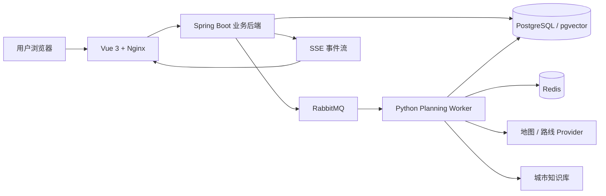

# TripPilot 智能旅行规划

TripPilot 是一个面向国内自由行的约束驱动型旅行规划平台。它把用户的日期、预算、兴趣、必去地点、固定安排和交通偏好转换为结构化约束，再结合真实 POI、路线与城市知识生成可执行、可解释的多日行程。

> 当前版本：可部署的 V1。默认提供无需外部 API Key 的确定性 Demo 模式，也支持接入高德与语义 Embedding 服务。

## What：这是一个什么项目

普通旅行攻略通常只给出地点清单，难以回答“时间是否来得及”“预算是否超限”“固定预约能否保留”等问题。TripPilot 将旅行规划建模为一条可验证的异步工作流：

1. 用户创建旅行并提交日期、预算、同行类型、兴趣和固定安排。
2. Java 服务持久化规划任务与 Outbox 事件。
3. Python Worker 检索候选 POI、路线和城市知识。
4. 候选地点经过过滤、去重、偏好评分和稳定排序。
5. OR-Tools CP-SAT 在时间、交通、预算与固定安排的硬约束下求解。
6. 结果以不可变行程版本保存，并通过 SSE 实时推送给网页端。
7. 无法满足约束时返回明确冲突与最小放宽建议，而不是静默生成错误结果。

### 核心功能

- 用户注册、登录、会话恢复和 HttpOnly Refresh Cookie 轮换。
- 创建旅行、维护结构化约束、乐观锁更新和用户数据隔离。
- 异步规划任务、实时 SSE 进度、断线补发和任务取消。
- 高德 POI/步行路线 Provider、Redis 缓存及无密钥 Demo 降级。
- 候选 POI 过滤、近似去重、偏好评分和确定性排序。
- OR-Tools 时间窗、交通、预算、必去地点和固定安排约束优化。
- 不可行规划的结构化冲突原因和放宽建议。
- 广州城市知识导入、pgvector 检索、版本化引用和新鲜度标记。
- 地图 Marker、步行路线、时间轴联动及无地图凭据降级视图。
- 不可变行程版本、活动与交通段持久化。
- Prometheus 指标、健康检查、死信队列、数据库备份和恢复工具。

### 技术栈

| 层级 | 技术 |
| --- | --- |
| Web | Vue 3、TypeScript、Vite、Pinia、Vue Router、Vitest、Nginx |
| 业务后端 | Java 21、Spring Boot、Spring Security、MyBatis、Flyway、Maven |
| 规划服务 | Python 3.12、FastAPI、Pydantic、aio-pika、OR-Tools、uv |
| 数据与检索 | PostgreSQL 16、PostGIS、pgvector、Redis |
| 异步通信 | RabbitMQ、Transactional Outbox、版本化 JSON Schema |
| 运维 | Docker Compose、Prometheus、GitHub Actions |

## Why：为什么开发 TripPilot

自由行规划的难点不是“推荐几个热门景点”，而是让地点、时间、交通、预算和用户偏好同时成立。纯文本生成很容易忽略通勤成本、重复地点、预约时间或硬预算，也很难解释为什么某个方案不可行。

TripPilot 的目标是把推荐能力与确定性约束结合起来：

- 外部数据与知识检索负责提供候选事实和来源。
- 可测试的规则负责过滤无效、重复或不匹配的候选项。
- OR-Tools 负责验证时间线和硬约束。
- 版本化事件与持久化模型保证异步链路可追踪、可重放。
- 失败结果同样是产品输出，用户可以根据冲突原因调整条件。

这种设计让生成结果从“看起来合理的攻略”变为“能够被系统校验并解释的计划”。

## How：系统如何工作



### 服务职责

- `apps/web`：登录、旅行工作台、规划进度、地图与时间轴展示。
- `apps/travel-server`：用户、旅行、任务、行程版本、安全、Outbox 与 SSE。
- `apps/agent-service`：候选生成、知识检索、路线获取、约束求解与消息消费。
- `contracts`：跨服务消息契约。
- `knowledge`：城市知识、来源注册表与固定评测集。
- `infra`：数据库扩展、监控与生产运行配置。

### 可靠性与安全设计

- 规划命令通过 Transactional Outbox 与 RabbitMQ 至少一次投递。
- 消费端执行幂等校验，避免重复消息生成重复行程版本。
- 任务取消同时经过消息控制面和数据库权威状态校验。
- Refresh Token 仅通过 HttpOnly Cookie 传输，不进入 JavaScript。
- Nginx 提供 CSP、安全响应头、可信代理解析和限流。
- 外部知识采集包含域名白名单、DNS 公网地址校验、响应大小限制和审核发布流程。

## 快速部署

### 环境要求

- Docker Desktop 或 Docker Engine
- Docker Compose v2
- 建议至少 8 GB 可用内存

### 1. 准备配置

```powershell
Copy-Item .env.example .env
```

Linux/macOS：

```bash
cp .env.example .env
```

编辑 `.env`，至少替换以下值：

```dotenv
POSTGRES_PASSWORD=your-local-postgres-password
REDIS_PASSWORD=your-local-redis-password
RABBITMQ_PASSWORD=your-local-rabbitmq-password
JWT_SECRET=your-random-secret-at-least-32-bytes
```

本机使用纯 HTTP 访问时设置：

```dotenv
DEMO_MODE=true
REFRESH_COOKIE_SECURE=false
```

生产环境必须使用 HTTPS，并保持 `REFRESH_COOKIE_SECURE=true`。真实密钥只能放在本地 `.env`、部署平台密钥管理或 GitHub Secrets 中。

### 2. 构建并启动

```powershell
docker compose -f compose.prod.yaml --env-file .env build
docker compose -f compose.prod.yaml --env-file .env up -d
docker compose -f compose.prod.yaml --env-file .env ps
```

知识初始化容器会自动执行数据库迁移并导入随仓库提供的广州语料，成功后再启动规划 Worker。

### 3. 访问服务

- Web：<http://127.0.0.1:8080>
- 健康检查：<http://127.0.0.1:8080/api/health>
- Prometheus：<http://127.0.0.1:9090>

打开 Web 后，注册账号、创建广州旅行并点击“开始规划”即可体验完整 Demo 流程。

### 4. 查看日志或停止服务

```powershell
docker compose -f compose.prod.yaml --env-file .env logs -f
docker compose -f compose.prod.yaml --env-file .env down
```

数据默认保存在 Docker Volume 中。若需要同时删除本地演示数据，可显式执行 `docker compose -f compose.prod.yaml --env-file .env down -v`。

## 接入真实 Provider

Demo 模式不依赖外部 LLM 或地图 Key。若需要真实 POI、路线和地图展示：

```dotenv
DEMO_MODE=false
AMAP_WEB_SERVICE_KEY=your-server-side-amap-key
VITE_AMAP_WEB_JS_KEY=your-browser-amap-key
VITE_AMAP_SECURITY_CODE=your-browser-security-code
```

浏览器 Key 与服务端 Web Service Key 必须分开使用。语义 Embedding 可通过 `KNOWLEDGE_EMBEDDING_PROVIDER` 和对应服务凭据配置；启用前应先运行固定检索评测集。

## 测试

```powershell
# Java
mvn --batch-mode -pl apps/travel-server clean verify

# Python
Set-Location apps/agent-service
uv sync --extra dev
uv run pytest
uv run ruff check .

# Web
Set-Location ../web
corepack enable
pnpm install --frozen-lockfile
pnpm test
pnpm build
```

当前质量基线：

- Java：95 项测试，JaCoCo 行覆盖率门禁 80%。
- Python：332 项测试，知识检索与采集覆盖率超过 90%。
- Web：50 项测试，行覆盖率超过 90%，分支覆盖率超过 80%。

## 文档

- [项目范围](docs/00-project-charter.md)
- [系统架构](docs/01-system-architecture.md)
- [领域与数据模型](docs/02-domain-and-data.md)
- [Agent 工作流](docs/03-agent-workflow.md)
- [约束优化](docs/04-planning-optimization.md)
- [数据、RAG 与 Provider](docs/05-data-rag-providers.md)
- [可靠性、安全与可观测性](docs/07-reliability-security-observability.md)
- [测试与评测](docs/08-testing-and-evaluation.md)
- [产品路线图](docs/09-roadmap-and-todos.md)
- [生产发布与恢复手册](docs/25-production-release-runbook.md)

## 已知边界

- V1 重点支持单城市自由行，不提供机票、火车票、酒店预订或支付。
- Demo 费用属于明确标记的估算值，不代表供应商实时报价。
- 静态知识会显示来源与新鲜度，但出发前仍应核验营业时间、预约和票价。
- 天气、实时票价及模型生成/修复循环需在 Provider 凭据和固定评测门禁通过后单独启用。
