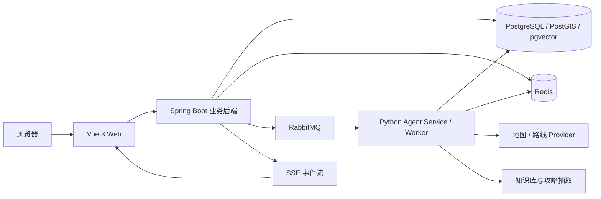

# TripPilot 智能旅行规划

TripPilot 是一个面向国内自由行的约束驱动型旅行规划平台。它把日期、预算、兴趣、必去地点、固定安排和交通偏好转换为结构化约束，再结合 POI、路线与城市情报生成可执行、可解释的多日行程。

> 当前基线：V2.0 本地 Demo/Compose 验收已形成证据，日期为 2026-07-27。生产发布仍需要部署者补齐 HTTPS、真实 Provider Key、域名白名单和高德 Web JS 底图验收。详见 [V2.0 发布状态](docs/release.md)。

## 核心能力

- 用户注册、登录、会话恢复和 HttpOnly Refresh Cookie 轮换。
- 旅行创建、约束维护、乐观锁更新、归档/恢复、分页筛选和用户数据隔离。
- 异步规划任务、真实阶段进度、SSE 断线补发、重复事件抑制和任务取消。
- 高德 POI/路线 Provider、Redis 缓存，以及无需外部 Key 的确定性 Demo 模式。
- 候选 POI 过滤、近似去重、偏好评分、确定性排序和 OR-Tools 约束求解。
- 不可行规划的结构化冲突原因和放宽建议。
- 广州城市知识、用户攻略导入、可信城市情报、事实新鲜度和规划快照。
- 不可变行程版本、版本差异、回滚、活动编辑和通勤段写回。
- 匿名只读分享链接、ICS 日历导出和支持中文字体的 PDF 导出。
- Prometheus 指标、健康检查、死信队列、受保护诊断入口、备份和恢复工具。

## 系统结构


```mermaid
flowchart LR
    U["浏览器"] --> W["Vue 3 Web"]
    W --> J["Spring Boot 业务后端"]
    J --> P[("PostgreSQL / PostGIS / pgvector")]
    J --> R[("Redis")]
    J --> Q["RabbitMQ"]
    J --> S["SSE 事件流"]
    Q --> A["Python Agent Service / Worker"]
    A --> P
    A --> R
    A --> M["地图 / 路线 Provider"]
    A --> K["知识库与攻略抽取"]
    S --> W
```

- `apps/web`：旅行工作台、规划进度、地图、版本、分享和导出体验。
- `apps/travel-server`：用户、旅行、任务、行程版本、安全、Outbox、SSE 和诊断。
- `apps/agent-service`：候选生成、知识检索、路线获取、约束求解和消息消费。
- `contracts`：跨 Java、Python、TypeScript 的消息契约。
- `knowledge`：城市知识文档、来源注册和固定评测语料。
- `infra`：数据库扩展、监控和生产运行配置。

## 快速启动

### 环境要求

- Docker Desktop 或 Docker Engine
- Docker Compose v2
- 建议至少 8 GB 可用内存

### 1. 准备配置

```powershell
Copy-Item .env.example .env
```

Linux/macOS：

```bash
cp .env.example .env
```

至少替换以下值：

```dotenv
POSTGRES_PASSWORD=your-local-postgres-password
REDIS_PASSWORD=your-local-redis-password
RABBITMQ_PASSWORD=your-local-rabbitmq-password
JWT_SECRET=your-random-secret-at-least-32-bytes
AGENT_INTERNAL_TOKEN=your-distinct-random-internal-token
INTERNAL_DIAGNOSTICS_TOKEN=your-distinct-random-diagnostics-token
```

本机 HTTP 演示可使用：

```dotenv
DEMO_MODE=true
REFRESH_COOKIE_SECURE=false
```

生产环境必须使用 HTTPS，并保持 `REFRESH_COOKIE_SECURE=true`。真实密钥只能放在本地 `.env`、部署平台密钥管理或 GitHub Secrets 中。

### 2. 构建并启动

```powershell
docker compose -f compose.prod.yaml --env-file .env build
docker compose -f compose.prod.yaml --env-file .env up -d
docker compose -f compose.prod.yaml --env-file .env ps
```

知识初始化容器会执行数据库迁移并导入随仓库提供的广州语料，成功后再启动规划 Worker。

### 3. 访问服务

- Web：<http://127.0.0.1:8080>
- 健康检查：<http://127.0.0.1:8080/api/health>
- Prometheus：<http://127.0.0.1:9090>

打开 Web 后注册账号并创建旅行。Demo 模式不依赖外部 LLM 或地图 Key；真实 Provider 失败时必须显示明确的降级或过期标记，不能伪装成实时成功。

### 4. 停止服务

```powershell
docker compose -f compose.prod.yaml --env-file .env logs -f
docker compose -f compose.prod.yaml --env-file .env down
```

数据默认保存在 Docker Volume 中。需要删除本地演示数据时，显式执行 `docker compose -f compose.prod.yaml --env-file .env down -v`。

## 接入真实 Provider

```dotenv
DEMO_MODE=false
AMAP_WEB_SERVICE_KEY=your-server-side-amap-key
VITE_AMAP_WEB_JS_KEY=your-browser-amap-key
VITE_AMAP_SECURITY_CODE=your-browser-security-code
```

浏览器 Key 与服务端 Web Service Key 必须分开使用。高德 Web JS Key、安全密钥和域名白名单需要在最终浏览器域名中验收；Demo 模式证据不能替代真实底图验收。

语义 Embedding 可通过 `KNOWLEDGE_EMBEDDING_PROVIDER` 和对应服务凭据配置；启用前应先运行固定检索评测集。

## 测试

```powershell
# Java
mvn --batch-mode -pl apps/travel-server clean verify

# Python
Set-Location apps/agent-service
uv sync --extra dev
uv run pytest
uv run ruff check .

# Web
Set-Location ../web
corepack enable
pnpm install --frozen-lockfile
pnpm test
pnpm typecheck
pnpm build
```

质量门禁以 CI 和发布证据为准，不在 README 中维护易过期的测试数量。

## 文档

- [文档入口](docs/README.md)：当前维护文档与归档规则。
- [产品与范围](docs/product.md)：当前能力、边界和下一步。
- [系统架构](docs/architecture.md)：服务职责、领域、数据和可靠性模型。
- [接口与契约](docs/api.md)：REST、MQ、SSE 和错误语义。
- [部署与运维](docs/deployment.md)：配置、启动、测试、备份和发布检查。
- [技术决策](docs/decision-record.md)：关键 ADR 的当前摘要。
- [发布状态](docs/release.md)：V2.0 验收证据、外部阻塞和已知风险。
- [历史归档](docs/archive/README.md)：旧路线图、V1.3 验收、V2 执行清单和审查报告。

## 已知边界

- V2.0 仍聚焦单城市自由行，不提供机票、火车票、酒店预订或支付。
- Demo 费用和路线属于明确标记的估算值，不代表供应商实时结果。
- 静态知识和社区攻略会显示来源与新鲜度；出发前仍应核验营业时间、预约和票价。
- 公开攻略导入不会绕过登录、验证码或反自动化限制；受限页面应改用用户主动提供的正文或文件。
- 真实生产发布必须补齐 HTTPS、Cookie 安全配置、真实 Provider 凭据、域名/IP 白名单和日志脱敏复核。
