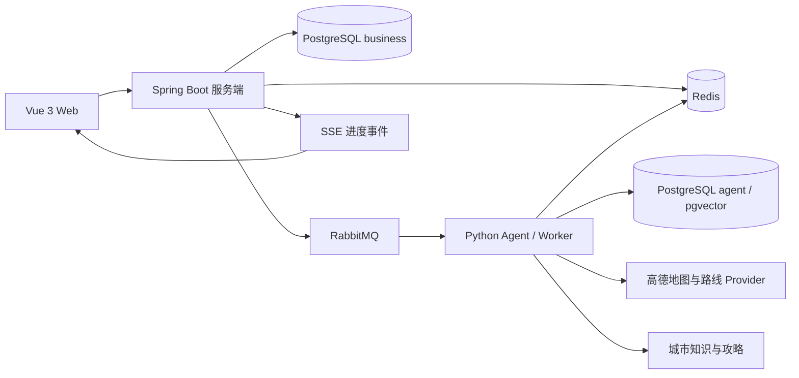

# TripPilot 智能旅行规划

TripPilot 是面向国内自由行的约束驱动旅行规划系统。它将日期、预算、兴趣、必去地点、固定安排和交通偏好转化为可执行、可解释且可恢复的多日行程。

当前版本处于**本地 RC 候选**阶段，远端 CI 已验证通过。尚未完成生产环境发布。

## 核心能力

- 用结构化约束创建旅行，以异步任务和 SSE 展示真实规划进度。
- 支持高德 POI、路线、Web 地图与无外部凭据的确定性 Demo 模式。
- 逐日容量驱动的骨架规划：日类型分类、到达/离开锚点、餐饮预留、固定安排与弹性时段填充。
- 交通段编辑写回后端并生成新的不可变版本；时间空档不足的方式标记为"需要调整行程"而非静默不可用。
- 多项行程调整先暂存为草稿，用户确认后一次性创建不可变版本。
- 版本差异、回滚与默认折叠的历史版本面板。
- 匿名只读分享、ICS 日历导出、支持中文的 PDF 导出。
- 五维确定性质量评分、结构化风险和可核验决策解释。
- 旅行归档/恢复、筛选搜索、知识导入与来源/新鲜度证据。
- 城市天气时间轴、地图日期联动、QWeather 与 AMap 天气数据。
- Prometheus 指标、健康检查、死信队列与受保护的诊断入口。

## 系统架构


```mermaid
flowchart LR
    Browser["Vue 3 Web"] --> Server["Spring Boot 服务端"]
    Server --> BusinessDB[("PostgreSQL business")]
    Agent --> AgentDB[("PostgreSQL agent / pgvector")]
    Server --> Cache[("Redis")]
    Server --> Queue["RabbitMQ"]
    Server --> Events["SSE 进度事件"]
    Queue --> Agent["Python Agent / Worker"]
    Agent --> Cache
    Agent --> Provider["高德地图与路线 Provider"]
    Agent --> Knowledge["城市知识与攻略"]
    Events --> Browser
```

| 目录 | 职责 |
| --- | --- |
| `apps/web` | Vue 3 旅行工作台、地图、规划进度、版本、分享与导出 |
| `apps/travel-server` | Spring Boot 领域 API、认证、旅行、行程版本、SSE 与 Outbox |
| `apps/agent-service` | Python 规划 Agent、路线/知识检索、约束求解与消息消费 |
| `contracts` | Java、Python 与 TypeScript 间的消息契约 |
| `knowledge` | 城市知识、来源登记与评测语料 |
| `infra` | 数据库扩展、监控与生产 Compose 配置 |

## 快速启动

### 前置条件

- Docker Desktop 或 Docker Engine
- Docker Compose v2
- 建议至少 8 GB 可用内存

### 1. 创建本地配置

```powershell
Copy-Item .env.example .env
```

在 `.env` 中至少替换以下本地密钥；不要将真实密钥提交到仓库：

```dotenv
POSTGRES_PASSWORD=your-local-postgres-password
REDIS_PASSWORD=your-local-redis-password
RABBITMQ_PASSWORD=your-local-rabbitmq-password
JWT_SECRET=your-random-secret-at-least-32-bytes
AGENT_INTERNAL_TOKEN=your-distinct-random-internal-token
INTERNAL_DIAGNOSTICS_TOKEN=your-distinct-random-diagnostics-token
PROVIDER_MODE=DEMO_ONLY
REFRESH_COOKIE_SECURE=false
```

### 2. 启动完整系统

```powershell
docker compose -f compose.prod.yaml --env-file .env up -d --build --wait --wait-timeout 180
```

默认访问地址：
- Web：`http://127.0.0.1:8080`
- Prometheus：`http://127.0.0.1:9090`

### 3. 停止服务

```powershell
docker compose -f compose.prod.yaml --env-file .env down
```

## 使用真实 Provider

```dotenv
PROVIDER_MODE=REAL_ONLY
AMAP_WEB_SERVICE_KEY=your-server-side-amap-key
QWEATHER_API_KEY=your-server-side-qweather-key
QWEATHER_API_HOST=your-dedicated-qweather-api-host
VITE_AMAP_WEB_JS_KEY=your-browser-amap-key
VITE_AMAP_SECURITY_CODE=your-browser-security-code
```

服务端 Web Service Key 与浏览器 Web JS Key 必须分开使用。生产环境还必须配置 HTTPS 和 `REFRESH_COOKIE_SECURE=true`。

## 测试

```powershell
# Java：单元、集成、Flyway 与验证
mvn --batch-mode -pl apps/travel-server verify

# Python：测试与静态检查
cd apps/agent-service
uv sync --extra dev
uv run pytest
uv run ruff check .

# Web：单元覆盖率、类型、生产构建与端到端链路
cd ../web
corepack enable
pnpm install --frozen-lockfile
pnpm test:coverage
pnpm typecheck
pnpm build
pnpm test:e2e
```

## 文档

- **[文档中心](docs/index.md)** — 完整文档导航
- [产品概述](docs/product/产品概述.md)
- [系统架构](docs/architecture/系统架构.md)
- [行程真实性与旅行骨架](docs/architecture/行程真实性与旅行骨架.md)
- [本地开发指南](docs/development/本地开发指南.md)
- [部署指南](docs/operations/部署指南.md)
- [架构决策记录](docs/adr/README.md)
- [项目路线图](docs/product/项目路线图.md)
- [历史归档](docs/archive/README.md)

## 已知边界

- 当前重点是单城市自由行；不提供机票、火车票、酒店预订或支付。
- Demo 费用和路线是明确标注的估算值，不代表实时供应商结果。
- 出发前仍应核验营业时间、预约和票价。
- 真实生产发布需要完成 HTTPS、Cookie 安全配置、Provider 凭据/白名单、日志脱敏复核和 staging 验收。
