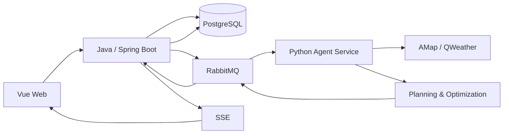

# TripPilot

一个约束驱动的智能旅行规划系统：生成真实、可执行、可编辑的行程。

> **定位**：TripPilot 是一个「确定性规划引擎 + 有界对话式 Agent」的混合系统。权威行程只由确定性规划管线产生（候选检索 → 可行性过滤 → 调度优化 → 交通 → 硬校验）；Agent 是有界会话层，只负责意图理解、约束收集、澄清与解释，全程通过 `build_itinerary` 工具触发确定性管线，自身不求解行程、没有发射行程的工具。
>
> 默认运行形态是确定性 `AskingDecider`（可复现、无需模型密钥）；配置 `STRUCTURED_MODEL_*` 后升级为 LLM 决策（结构化输出）。架构详见[系统架构](docs/architecture.md)，关键取舍见[架构决策记录](docs/decisions.md)。

## 与普通 LLM 旅行规划的区别

| 普通 LLM 行程生成 | TripPilot |
|---|---|
| 主要依赖文本生成，结果"看起来合理" | 结构化约束 + 确定性调度，对时间/交通/营业时间做可行性验证 |
| 修改通常重新生成全文 | 局部编辑、重新规划、不可变版本树（diff / 回滚） |
| 数据来自模型记忆，无法解释 | 高德/QWeather 真实 Provider，校验失败可输出具体冲突原因 |
| 关键数据不确定时编造一个结果 | fail-closed：显式表达 UNKNOWN / 不可行，拒绝伪造成功 |

## 核心能力

- **约束驱动规划**：目的地、日期、预算、偏好、必去点、固定安排、住宿等结构化约束。
- **可行性硬校验**：11 条规则（营业时间、时间冲突、通勤成本、预算、必去覆盖等）+ 有界修复，三态结论（通过 / 待修复 / 不可行）。
- **多模式交通**：WALKING / TRANSIT / TAXI / DRIVING / AUTO，路线来自 Provider 事实，请求模型与持久化模型严格区分。
- **可选精确调度**：日内调度支持 OR-Tools CP-SAT（`PLANNING_DAY_SCHEDULER=CPSAT/SHADOW`），失败自动回退贪心，[调度基准](apps/agent-service/benchmarks/scheduler/README.md)。
- **攻略情报**：公开链接、粘贴正文、TXT/Markdown、小红书分享文本、截图 OCR（需视觉模型）多源导入，统一进入事实校验与冲突合并。
- **知识检索（RAG）**：pgvector 向量库 + 来源/新鲜度证据链。
- **不可变版本管理**：编辑生成新版本，支持 diff、回滚、幂等重放。
- **真实异步工作流**：Java API → 事务性 Outbox → RabbitMQ → Python Worker → 事件回写 → SSE 推送。

## 系统架构


```mermaid
flowchart LR
    Web[Vue Web] --> API[Java / Spring Boot]
    API --> DB[(PostgreSQL)]
    API --> MQ[RabbitMQ]

    MQ --> Agent[Python Agent Service]
    Agent --> Provider[AMap / QWeather]
    Agent --> Planner[Planning & Optimization]

    Planner --> MQ
    MQ --> API

    API --> DB
    API --> SSE[SSE]
    SSE --> Web
```

| 层 | 技术 | 职责 |
|---|---|---|
| 前端 | Vue 3, TypeScript, Vite | 行程创建/编辑/进度/地图/版本 UI |
| 后端 | Java 21, Spring Boot, MyBatis | API、领域逻辑、持久化、版本、SSE、消息可靠性 |
| 规划 | Python 3.12, FastAPI, LangGraph | 规划工作流、可行性、优化、Agent 编排 |
| 消息 | RabbitMQ | 隔离同步 API 与长时规划任务 |
| 数据 | PostgreSQL, PostGIS, pgvector | 业务、空间与向量数据 |
| 缓存 | Redis | Agent checkpoint 与运行时缓存 |
| 基础设施 | Docker Compose | 本地可复现环境，9 个服务全部带健康检查 |

## 快速开始

### 环境要求

- **运行**：Docker Desktop / Docker Engine + Compose v2（建议至少 8 GB 内存）
- **本地开发（可选）**：JDK 21、Python 3.12+ 与 [uv](https://docs.astral.sh/uv/)、Node.js 24 与 pnpm

### 1. 配置

```bash
cp .env.example .env
```

为 `POSTGRES_PASSWORD`、`REDIS_PASSWORD`、`RABBITMQ_PASSWORD`、`JWT_SECRET`、`AGENT_INTERNAL_TOKEN`、`INTERNAL_DIAGNOSTICS_TOKEN` 设置互不相同的本地值。

- **无真实 Key**：保持 `PROVIDER_MODE=DEMO_ONLY` 即可运行完整主流程（确定性演示数据，界面明确标注 DEMO）。
- **真实数据**：设置 `PROVIDER_MODE=REAL_ONLY`（或 `REAL_WITH_EXPLICIT_FALLBACK`），并填入 `AMAP_WEB_SERVICE_KEY`、`QWEATHER_API_KEY`、`VITE_AMAP_WEB_JS_KEY` + `VITE_AMAP_SECURITY_CODE`。
- 缺失关键凭据时 Worker 启动即失败（fail-closed），不会静默降级。

### 2. 启动

```bash
docker compose -f compose.prod.yaml --env-file .env up -d --build --wait --wait-timeout 240
```

- Web：<http://127.0.0.1:8080>（API 经 `/api` 反代）
- Prometheus（可选）：<http://127.0.0.1:9090>

停止：`docker compose -f compose.prod.yaml down`（加 `-v` 删除数据卷）。

### 演示账号

| 登录名 | 密码 | 说明 |
| --- | --- | --- |
| `admin@admin.com` | `Admin123456` | 预置管理员（Flyway V42 种子，随建库创建） |

登录框同时接受邮箱或用户名。**对外部署前请删除或改掉该预置账号。**

## 测试

当前发布通过全部自动化套件（含一条零 mock 的真实端到端链路：Web → Java → MQ → Python → 行程完成 → 真实渲染）。

- Python：**2112 passed / 42 skipped**（skip 为需真实凭据/数据库的可选用例）· ruff 0 违规
- Java：**621 passed** · JaCoCo 行覆盖率 ≥ 80% 硬门禁
- Web：**350 passed** · typecheck 0 · 生产构建通过 · 覆盖率门禁 80%
- CI：5 个 job（java / python / web / infrastructure / repository-safety），其中 infrastructure job 强制 9 个镜像 digest 固定并跑 Compose 冒烟

本地开发与测试命令见[开发指南](docs/development.md)。

## 文档

| 文档 | 内容 |
|---|---|
| [系统架构](docs/architecture.md) | 服务职责、规划管线、Agent 边界、异步链路、契约与数据 |
| [开发指南](docs/development.md) | 仓库结构、三栈本地开发、测试门禁、基准工具 |
| [运行与运维](docs/operations.md) | Compose 服务矩阵、环境变量、监控、备份、安全清单 |
| [产品与路线图](docs/roadmap.md) | 版本历史、当前限制、后续规划 |
| [架构决策记录](docs/decisions.md) | 关键设计取舍及其理由（浓缩版 ADR） |

## 当前限制

- 面向中国境内单城市自由行设计；跨城联程未排期。
- 规划质量依赖外部 Provider 数据可用性（高德 / QWeather）。
- 网页攻略导入仅支持可公开访问的静态 HTTPS 页面（不登录、不执行 JS、不绕过访问控制）；动态渲染或登录墙页面请改用粘贴正文或截图导入。
- 截图 OCR 导入需配置 OpenAI 兼容视觉模型（`OCR_MODEL_*`），未配置时返回明确提示。
- 当前发布按完整软件发布标准验证，本地优先运行，未做大规模公网生产部署。

## License

[MIT](LICENSE) © 2026 tobehardoo
