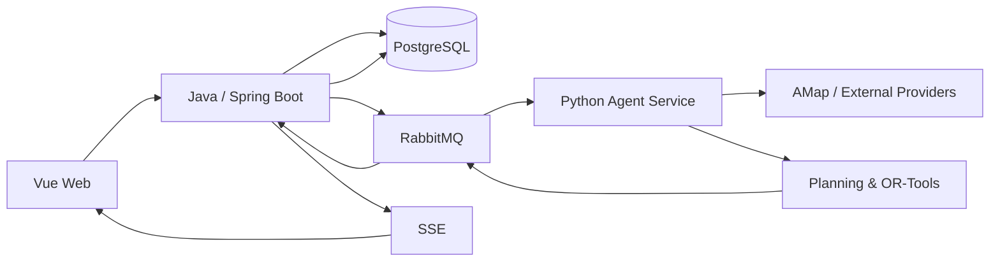

# TripPilot

A constraint-driven intelligent travel planning system for generating realistic, executable, and editable itineraries.

TripPilot is designed for independent travel planning in China. Instead of simply asking an LLM to "generate a trip", it treats travel planning as a constrained planning problem involving time windows, transportation, budgets, fixed activities, must-visit places, accommodation, real-world provider data, and itinerary feasibility.

> TripPilot 是一个面向国内自由行场景的约束驱动旅行规划系统，目标不是生成"看起来合理"的行程，而是生成时间、交通、预算和现实条件上**真正可执行**的旅行计划。

## 与普通 AI 旅行规划的区别

| 普通 LLM 行程生成 | TripPilot |
|---|---|
| 主要依赖文本生成 | 结构化约束 + 确定性规划 |
| 行程可能看起来合理 | 对时间、交通、营业时间等做可行性验证 |
| 修改通常重新生成全文 | 支持编辑、局部重规划和版本管理 |
| 数据可能来自模型记忆 | 使用 Provider 获取真实地点和路线数据 |
| 很难解释为什么不可行 | 能输出不可行原因和约束冲突 |

## 核心能力

- **Constraint-driven planning**：目的地、日期、预算、偏好、must-visit、固定安排、住宿等结构化约束。
- **Executable itinerary generation**：多日行程、景点安排、交通连接、时间窗与游玩时长。
- **Multi-source guide intelligence（攻略情报）**：公开链接、粘贴正文、TXT/Markdown、小红书分享文本、图片截图 OCR（需配置视觉模型）与城市实时资料同步；所有来源进入同一事实校验、冲突合并与规划证据链路。
- **Multi-mode transport**：WALKING / TRANSIT / TAXI / DRIVING / AUTO 等交通语义与路线信息。
- **Feasibility validation**：营业时间、时间冲突、通勤成本、预算和不可行解释。
- **Editable & versioned itineraries**：编辑、重新规划、版本对比、回滚、分享与导出。
- **Real asynchronous workflow**：Java API → Outbox → RabbitMQ → Python Planner → Event → Java Persistence → SSE。

## 系统架构


```mermaid
flowchart LR
    Web[Vue Web] --> API[Java / Spring Boot]
    API --> DB[(PostgreSQL)]
    API --> MQ[RabbitMQ]

    MQ --> Agent[Python Agent Service]
    Agent --> Provider[AMap / External Providers]
    Agent --> Planner[Planning & OR-Tools]

    Planner --> MQ
    MQ --> API

    API --> DB
    API --> SSE[SSE]
    SSE --> Web
```

- **Java**（travel-server）：用户、行程、版本、持久化、API、消息可靠性（Outbox / 幂等 / SSE）。
- **Python**（agent-service）：候选处理、可行性、规划、交通与优化。
- **RabbitMQ**：隔离同步 API 与长时间规划任务。
- **PostgreSQL / PostGIS / pgvector**：业务数据、空间数据与知识检索。

## Planning Pipeline

```text
User Constraints
      ↓
Constraint Normalization
      ↓
Candidate Retrieval
      ↓
Provider Enrichment
      ↓
Feasibility Filtering
      ↓
Scheduling / Optimization
      ↓
Transport Planning
      ↓
Hard Validation
      ↓
Itinerary Persistence
```

LLM/Agent 组件用于语义推理场景；硬约束与可执行调度由确定性规则与优化（OR-Tools）负责——各做各自擅长的事情。

## 技术栈

| Layer | Technology | Responsibility |
|---|---|---|
| Frontend | Vue 3, TypeScript, Vite | Trip creation, editing, progress, itinerary UI |
| Backend | Java 21, Spring Boot, MyBatis | API, domain logic, persistence, versions, SSE |
| Planning | Python 3.12, FastAPI, OR-Tools | Planning workflow, feasibility, optimization |
| Messaging | RabbitMQ | Async planning and completion events |
| Data | PostgreSQL, PostGIS, pgvector | Business, spatial and vector data |
| Cache | Redis | Runtime/cache support |
| Infra | Docker Compose | Local reproducible environment |

## 工程设计亮点

### Reliable asynchronous planning

API 不同步等待复杂规划，通过 Outbox + RabbitMQ 驱动 Python Worker，规划结果通过事件回写，并通过 SSE 更新前端。

### Immutable itinerary versions

编辑不会直接破坏已有行程，而是形成新的版本，支持 diff、rollback 和可追踪修改；正式版本只来自可行性验证通过的候选。

### Idempotency & consistency

对编辑和异步事件处理提供幂等保护，避免重复消费、重复修改等问题。

### Contract versioning

Java 与 Python 之间通过明确的 Event Contract 和版本策略协作（JSON Schema 为权威），而不是随意传 JSON。

### Fail-closed feasibility

关键数据不确定时不会伪造"成功"，而是显式表达 UNKNOWN / UNRESOLVED / infeasible；畸形 Provider 响应拒绝而非降级误报。

### Real end-to-end validation

不仅测试 Planner 函数，还验证完整链路：

> HTTP → Java → RabbitMQ → Python → Provider → Planning → Event → Java → DB → SSE / Web

## Quick Start

### Requirements

- **运行**：Docker Desktop / Docker Engine + Compose v2（建议至少 8 GB 内存）
- **本地开发（可选）**：JDK 21、Python 3.12+、Node.js + pnpm

### 1. Clone

```bash
git clone https://github.com/tobehardoo/trip-pilot-agent.git
cd trip-pilot-agent
```

### 2. Configure

```bash
cp .env.example .env
```

为 `POSTGRES_PASSWORD`、`REDIS_PASSWORD`、`RABBITMQ_PASSWORD`、`JWT_SECRET`、`AGENT_INTERNAL_TOKEN`、`INTERNAL_DIAGNOSTICS_TOKEN` 设置互不相同的本地值。

- **无真实 Key**：保持 `PROVIDER_MODE=DEMO_ONLY` 即可运行完整主流程（确定性 Demo 数据，明确标注）。
- **真实数据**：设置 `PROVIDER_MODE=REAL_ONLY`（或 `REAL_WITH_EXPLICIT_FALLBACK`），并在 `.env` 填入 `AMAP_WEB_SERVICE_KEY`（高德 Web 服务）、`QWEATHER_API_KEY`、`VITE_AMAP_WEB_JS_KEY` + `VITE_AMAP_SECURITY_CODE`（前端地图）。
- 缺失关键 Key 时 Worker 启动即失败（fail-closed），不会静默降级。

### 3. Start

```bash
docker compose -f compose.prod.yaml --env-file .env up -d --build --wait --wait-timeout 240
```

- Web：<http://127.0.0.1:8080>（API 经 `/api` 代理）
- Prometheus（可选）：<http://127.0.0.1:9090>

停止：`docker compose -f compose.prod.yaml --env-file .env down`（加 `-v` 删除数据卷）。

### 演示账号

| 登录名 | 密码 | 说明 |
| --- | --- | --- |
| `admin@admin.com` | `Admin123456` | 预置管理员（Flyway V42 种子，随建库自动创建） |

- 登录框同时接受邮箱或用户名；该账号由种子迁移产生，注册接口行为不变。
- 对外部署前请删除或改掉该预置账号（`DELETE FROM business.user_account WHERE email='admin@admin.com';` 或更新 `password_hash`）。

## 测试

当前发布通过 Python、Java、Web、Contract、集成测试与真实端到端规划工作流的全部自动化套件。

### Current release validation（v1.0 收口）

- Python: **1717 passed**（3 个可选真实 AMap 单测保留 skip）· ruff 0
- Java: **558 passed**
- Web: **446 passed** · coverage 95.51% · typecheck 0
- Real browser E2E: **PASS**（零 mock 真实链路）
- Interface matrix / full-chain samples: **61/61 / 13/13**

测试门禁与常见坑见 [测试策略](docs/development/测试策略.md)。

## Current Limitations

- Primarily designed for domestic single-city independent travel.
- Real-world planning quality depends on external provider data availability（高德 / QWeather）。
- 网页攻略导入仅支持可公开访问的静态 HTTPS 页面：不登录、不执行 JS、不绕过验证码或平台访问控制；动态渲染或登录墙页面请改用粘贴正文或图片截图导入。
- 图片截图导入需要配置 OpenAI 兼容视觉模型（`OCR_MODEL_*`）；未配置时返回明确提示，不影响其他导入方式。
- manual-edit TRANSIT 使用本地估计（Planner 生成的 TRANSIT 已是真实 AMap）；请求模型（TAXI/AUTO）与持久化模型严格区分。
- The current release is validated as a complete software release, but is not presented as a large-scale public production deployment（本地优先运行，未部署公网）。

## Roadmap

**当前主线：Agent 化改造（v1.1）** —— 在确定性内核之上叠加有界的 LangGraph Agent 编排层：LLM 负责意图理解、约束收集、策略选择与澄清，OR-Tools 求解、可行性校验与终态生成由确定性系统守门（`validate_itinerary` 一票否决）。详见 [Agent化路线图](docs/product/Agent化路线图.md) 与 [ADR-015](docs/adr/Agent编排层与记忆系统.md)。

- Richer preference modeling（用户交通偏好、行程节奏）
- Advanced multimodal transport planning（manual-edit TRANSIT 真实化、跨城 TRANSIT）
- Weather-aware planning（天气与行李输入）
- Stronger global itinerary optimization（OR-Tools 级跨 leg 联合优化）
- Broader multi-city planning（多城市联程）

详细路线图见 [项目路线图](docs/product/项目路线图.md)。

## Documentation

- [文档中心](docs/index.md) — 按目的导航全部文档
- [系统架构](docs/architecture/系统架构.md) — 主链路与模块职责
- [本地运行指南](docs/operations/本地运行指南.md) — Docker Compose 完整运行
- [本地开发指南](docs/development/本地开发指南.md) — 按服务开发与调试
- [测试策略](docs/development/测试策略.md) — 质量门禁
- [项目路线图](docs/product/项目路线图.md) — 当前版本、限制与下一版本
- [Agent化路线图](docs/product/Agent化路线图.md) — 未来主线（Phase 1–3）
- [ADR 索引](docs/adr/README.md) — 架构决策记录

## License

[MIT](LICENSE) © 2026 tobehardoo
