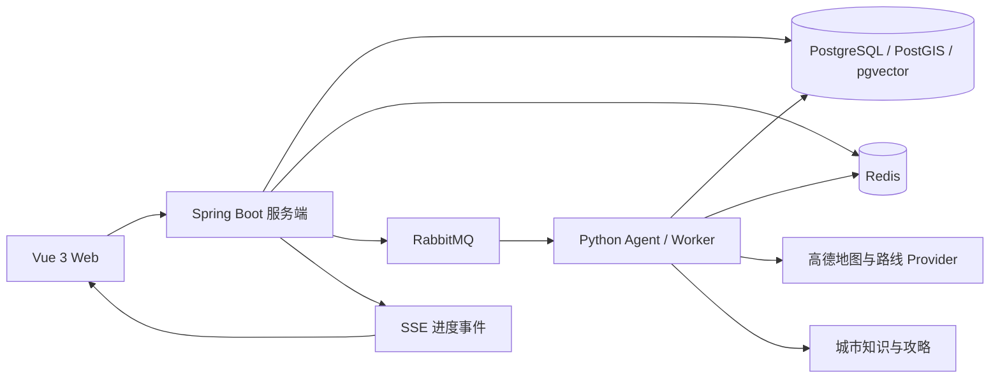

# TripPilot 智能旅行规划

TripPilot 是面向国内自由行的约束驱动旅行规划系统。它将日期、预算、兴趣、必去地点、固定安排和交通偏好转化为可执行、可解释且可恢复的多日行程。

当前版本：**V2.5**。本地 Compose 验收、服务端集成测试、前端质量门禁与浏览器样本用户链路均已通过；完整记录见 [V2.5 验收证据](docs/archive/v2.5-release-evidence.md)。

## 能力概览

- 用结构化约束创建旅行，并以异步任务和 SSE 展示真实规划进度。
- 支持高德 POI、路线、Web 地图与无外部凭据的确定性 Demo 模式。
- 对超过 20 分钟的步行自动生成可审阅的推荐交通草稿；用户可确认、改选或放弃。
- 多项行程调整先暂存为草稿，只在用户确认后一次性创建不可变版本。
- 版本差异、回滚与默认折叠的历史版本面板，避免版本列表占满页面。
- 匿名只读分享、ICS 日历导出、支持中文的 PDF 导出。
- 旅行归档/恢复、筛选搜索、知识导入与来源/新鲜度证据。
- Prometheus 指标、健康检查、死信队列与受保护的诊断入口。

## 系统架构


```mermaid
flowchart LR
    Browser["Vue 3 Web"] --> Server["Spring Boot 服务端"]
    Server --> Database[("PostgreSQL / PostGIS / pgvector")]
    Server --> Cache[("Redis")]
    Server --> Queue["RabbitMQ"]
    Server --> Events["SSE 进度事件"]
    Queue --> Agent["Python Agent / Worker"]
    Agent --> Database
    Agent --> Cache
    Agent --> Provider["高德地图与路线 Provider"]
    Agent --> Knowledge["城市知识与攻略"]
    Events --> Browser
```

| 目录 | 职责 |
| --- | --- |
| `apps/web` | Vue 3 旅行工作台、地图、规划进度、版本、分享与导出体验 |
| `apps/travel-server` | Spring Boot 领域 API、认证、旅行、行程版本、SSE 与 Outbox |
| `apps/agent-service` | Python 规划 Agent、路线/知识检索、约束求解与消息消费 |
| `contracts` | Java、Python 与 TypeScript 间的消息契约 |
| `knowledge` | 城市知识、来源登记与评测语料 |
| `infra` | 数据库扩展、监控与生产 Compose 配置 |

## 快速启动

### 前置条件

- Docker Desktop 或 Docker Engine
- Docker Compose v2
- 建议至少 8 GB 可用内存

### 1. 创建本地配置

```powershell
Copy-Item .env.example .env
```

Linux/macOS：

```bash
cp .env.example .env
```

在 `.env` 中至少替换以下本地密钥；不要将真实密钥提交到仓库。

```dotenv
POSTGRES_PASSWORD=your-local-postgres-password
REDIS_PASSWORD=your-local-redis-password
RABBITMQ_PASSWORD=your-local-rabbitmq-password
JWT_SECRET=your-random-secret-at-least-32-bytes
AGENT_INTERNAL_TOKEN=your-distinct-random-internal-token
INTERNAL_DIAGNOSTICS_TOKEN=your-distinct-random-diagnostics-token

# 本地 Demo
PROVIDER_MODE=DEMO_ONLY
REFRESH_COOKIE_SECURE=false
```

### 2. 启动完整系统

```powershell
docker compose -f compose.prod.yaml --env-file .env up -d --build --wait --wait-timeout 180
docker compose -f compose.prod.yaml --env-file .env ps
```

默认访问地址：

- Web：`http://127.0.0.1:8080`
- Prometheus：`http://127.0.0.1:9090`

端口可通过 `.env` 中的 `WEB_PORT` 和 `PROMETHEUS_PORT` 调整。首次启动时，知识初始化容器会迁移数据库并导入随仓库提供的广州知识。

查看日志或停止服务：

```powershell
docker compose -f compose.prod.yaml --env-file .env logs -f
docker compose -f compose.prod.yaml --env-file .env down
```

数据默认保留在 Docker Volume 中。仅在明确要清除本地演示数据时执行 `down -v`。

## 使用真实 Provider

本地 Demo 不依赖外部地图、天气或模型凭据。要启用真实高德规划和 QWeather 城市天气，请在部署环境中配置：

```dotenv
PROVIDER_MODE=REAL_ONLY
AMAP_WEB_SERVICE_KEY=your-server-side-amap-key
QWEATHER_API_KEY=your-server-side-qweather-key
QWEATHER_API_HOST=your-dedicated-qweather-api-host
VITE_AMAP_WEB_JS_KEY=your-browser-amap-key
VITE_AMAP_SECURITY_CODE=your-browser-security-code
```

`PROVIDER_MODE` 是权威配置；`DEMO_MODE` 仅用于旧部署兼容，不要同时设置冲突值。服务端 Web Service Key 与浏览器 Web JS Key 必须分开使用。QWeather Host 必须使用控制台为账号分配的 HTTPS Host，不能把开发默认 Host 当作生产验收结果。生产环境还必须配置 HTTPS、`REFRESH_COOKIE_SECURE=true`，并在高德控制台为最终浏览器域名配置相应的 Key、安全密钥、配额和白名单。

## 测试

```powershell
# Java：单元、集成、Flyway 与验证
mvn --batch-mode -pl apps/travel-server verify

# Python：测试与静态检查
Set-Location apps/agent-service
uv sync --extra dev
uv run pytest
uv run ruff check .

# Web：单元覆盖率、类型、生产构建与端到端链路
Set-Location ../web
corepack enable
pnpm install --frozen-lockfile
pnpm test:coverage
pnpm typecheck
pnpm build
pnpm test:e2e
```

V2.5 的浏览器样本覆盖会话恢复、编辑预览、多项草稿确认、SSE 重连/去重与窄屏匿名分享。详细命令和验收结果见 [验收证据](docs/archive/v2.5-release-evidence.md)。

## 文档

- [文档入口](docs/README.md)
- [产品与范围](docs/product.md)
- [系统架构](docs/architecture.md)
- [接口与契约](docs/api.md)
- [部署与运维](docs/deployment.md)
- [技术决策](docs/decision-record.md)
- [发布状态](docs/release.md)
- [历史归档](docs/archive/README.md)

## 已知边界

- 当前重点是单城市自由行；不提供机票、火车票、酒店预订或支付。
- Demo 费用和路线是明确标注的估算值，不代表实时供应商结果。
- 出发前仍应核验营业时间、预约和票价。
- 真实生产发布需要完成 HTTPS、Cookie 安全配置、Provider 凭据/白名单和日志脱敏复核。
