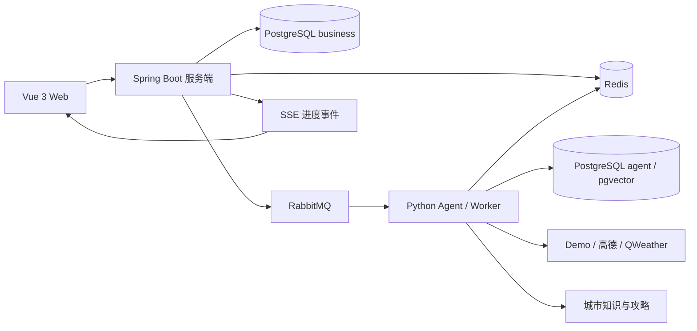

# TripPilot 智能旅行规划

TripPilot 是一个面向国内单城市自由行的个人学习项目。它把日期、预算、兴趣、必去地点、固定安排和交通偏好转化为可解释、可编辑、可恢复的多日行程。

项目以**本地运行**为主要使用方式：默认使用确定性的 `DEMO_ONLY` 模式，无需申请地图或天气凭据即可体验完整主流程。高德与 QWeather 是可选增强，不是启动项目的前置条件。

## 当前能力

- 结构化创建旅行，并通过异步任务与 SSE 展示真实规划进度。
- 逐日容量驱动规划：到达/离开锚点、餐饮预留、固定安排与弹性时段填充。
- 行程编辑、不可变版本、差异比较与回滚。
- 匿名只读分享、PDF 与 ICS 导出。
- 确定性体验评分、结构化风险与可核验解释。
- 城市知识导入、来源与新鲜度证据、天气时间轴和地图日期联动。
- 可选接入高德 POI/路线/Web 地图和 QWeather；无凭据时使用明确标注的 Demo 数据。
- 健康检查、Prometheus 指标、消息重试与死信处理、受保护的内部诊断入口。

营业时间的数据基础已经具备解析、证据与冲突/过期处理能力，但完整 Hard Validation、住宿三态和跨日连续性仍在完善中。当前行程适合本地体验与工程验证，出发前仍应核验营业时间、预约、票价与交通信息。

## 架构概览


```mermaid
flowchart LR
    Browser["Vue 3 Web"] --> Server["Spring Boot 服务端"]
    Server --> BusinessDB[("PostgreSQL business")]
    Server --> Cache[("Redis")]
    Server --> Queue["RabbitMQ"]
    Server --> Events["SSE 进度事件"]
    Queue --> Agent["Python Agent / Worker"]
    Agent --> AgentDB[("PostgreSQL agent / pgvector")]
    Agent --> Cache
    Agent --> Provider["Demo / 高德 / QWeather"]
    Agent --> Knowledge["城市知识与攻略"]
    Events --> Browser
```

| 目录 | 职责 |
| --- | --- |
| `apps/web` | Vue 3 旅行工作台、地图、规划进度、版本、分享与导出 |
| `apps/travel-server` | Spring Boot 领域 API、认证、旅行、行程版本、SSE 与 Outbox |
| `apps/agent-service` | Python 规划 Agent、路线/知识检索、约束求解与消息消费 |
| `contracts` | Java、Python 与 TypeScript 间的消息契约 |
| `knowledge` | 城市知识、来源登记与评测语料 |
| `infra` | 数据库扩展与可选监控配置 |

## 本地快速启动

前置条件：Docker Desktop 或 Docker Engine、Docker Compose v2，建议至少 8 GB 可用内存。

### 1. 创建配置

```powershell
Copy-Item .env.example .env
```

在 `.env` 中为以下变量设置互不相同的本地值，不要提交该文件：

```dotenv
POSTGRES_PASSWORD=your-local-postgres-password
REDIS_PASSWORD=your-local-redis-password
RABBITMQ_PASSWORD=your-local-rabbitmq-password
JWT_SECRET=your-random-secret-at-least-32-bytes
AGENT_INTERNAL_TOKEN=your-distinct-random-internal-token
INTERNAL_DIAGNOSTICS_TOKEN=your-distinct-random-diagnostics-token
PROVIDER_MODE=DEMO_ONLY
REFRESH_COOKIE_SECURE=false
```

### 2. 启动并访问

```powershell
docker compose -f compose.prod.yaml --env-file .env up -d --build --wait --wait-timeout 180
```

- Web：`http://127.0.0.1:8080`
- Prometheus（可选查看）：`http://127.0.0.1:9090`

### 3. 停止

```powershell
docker compose -f compose.prod.yaml --env-file .env down
```

完整说明、数据保留方式和真实 Provider 配置见[本地运行指南](docs/operations/本地运行指南.md)。

## 开发与验证

```powershell
# Java
mvn --batch-mode -pl apps/travel-server verify

# Python
cd apps/agent-service
uv sync --extra dev
uv run pytest
uv run ruff check .

# Web（当前目录为 apps/agent-service）
Set-Location ../web
corepack enable
pnpm install --frozen-lockfile
pnpm test:coverage
pnpm typecheck
pnpm build
pnpm test:e2e
```

各层测试范围、覆盖率门槛和真实 Provider 测试方法见[测试策略](docs/development/测试策略.md)。文档不长期保存容易过期的测试数量；当前结果以实际命令和 CI 为准。

## 项目边界

- 当前重点是国内单城市自由行。
- 不提供机票、火车票、酒店库存、支付或真实预订。
- 不把公网部署、TLS、镜像仓库、固定出口 IP、生产告警、备份恢复或 24 小时稳定性测试作为项目完成条件。
- 如果未来决定公开部署，应另行建立安全、隐私、运维和第三方 Provider 的发布门禁。

## 文档

- **[文档中心](docs/index.md)**
- [产品概述](docs/product/产品概述.md)
- [项目路线图](docs/product/项目路线图.md)
- [系统架构](docs/architecture/系统架构.md)
- [行程真实性与旅行骨架](docs/architecture/行程真实性与旅行骨架.md)
- [本地运行指南](docs/operations/本地运行指南.md)
- [本地开发指南](docs/development/本地开发指南.md)
- [架构决策记录](docs/adr/README.md)
- [历史归档](docs/archive/README.md)
