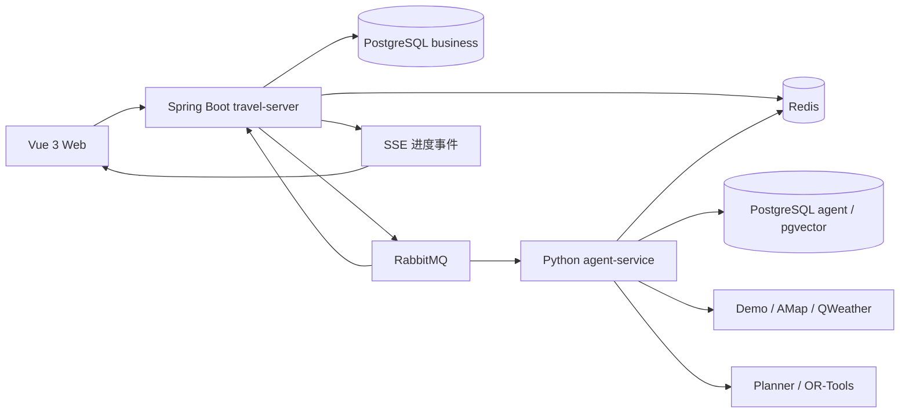

# TripPilot

> Constraint-driven travel planning system for real, executable itineraries.

TripPilot 是一个面向国内单城市自由行的**约束驱动旅行规划系统**：把日期、预算、必去地点、固定安排、用餐窗口与交通偏好转化为**真实、可执行、可编辑、可回滚**的多日行程。

它不是一个"LLM 聊天式行程生成器"。规划由结构化约束驱动，经确定性 Hard Validation 与可行性判定后才产出正式行程版本——**每一步都可用代码解释，而不是凭大模型"编"出来**。

项目本地优先运行：默认 `DEMO_ONLY` 模式无需任何外部凭据即可体验完整主流程；高德与 QWeather 是可选增强。

## 核心能力

- **结构化旅行约束**：必去/回避地点、固定安排、时间窗、用餐三态（默认/自定义/不安排）、预算、出行节奏、到达/离开时间。
- **多日行程规划**：逐日容量驱动（到离锚点、餐饮预留、固定安排与弹性时段填充），跨日位置连续。
- **真实交通模式**：WALKING / TRANSIT / DRIVING 由 Provider facts 驱动；TAXI / AUTO 作为请求模型，持久化模型严格区分。
- **交通与时长计算**：路线/通勤时间/费用来自 Provider 或明确标注的 DEMO 估计，行程总价包含交通票价。
- **住宿语义**：CONFIRMED / AREA_ESTIMATED / UNRESOLVED 三态，端到端输出到行程版本与界面，绝不伪造确认。
- **Hard Validation**：11/11 规则（营业时间、跨日连续性、游玩时长、餐饮窗口、重复/重叠…）→ 三态 Feasibility Report → 有界 repair；不可行时给出明确解释（`NO_FEASIBLE_ITINERARY`），不产生"假成功"。
- **行程编辑与版本**：MOVE / 时间 / 模式编辑 → 候选预览 → 异步验证 → 提交；不可变版本、差异比较、回滚；正式版本只来自 VERIFIED 候选。
- **真实地点检索**：省市区级联 + 地点搜索（PlaceRef 全链路），Demo 候选明确标注。
- **分享与导出**：匿名只读分享、PDF、ICS。
- **城市情报**：城市知识导入、来源与新鲜度证据、公共天气窗口（QWeather/高德归因）。
- **异步规划与进度**：RabbitMQ 任务 → SSE 实时进度 → 终态事件（SUCCEEDED / WAITING_USER / FAILED / CANCELLED）。

## 系统架构


```mermaid
flowchart LR
    Browser["Vue 3 Web"] --> API["Spring Boot travel-server"]
    API --> BizDB[("PostgreSQL business")]
    API --> Cache[("Redis")]
    API --> Queue["RabbitMQ"]
    API --> SSE["SSE 进度事件"]
    Queue --> Agent["Python agent-service"]
    Agent --> AgentDB[("PostgreSQL agent / pgvector")]
    Agent --> Cache
    Agent --> Provider["Demo / AMap / QWeather"]
    Agent --> Planner["Planner / OR-Tools"]
    Queue --> API
    SSE --> Browser
```

- `apps/web`：Vue 3 旅行工作台（约束编辑、规划进度、行程查看、版本、分享导出）。
- `apps/travel-server`：Spring Boot 领域 API（认证、行程、版本、SSE、Outbox 发布）。
- `apps/agent-service`：Python 规划 Agent（候选检索、Provider 增强、可行性、调度、消息消费）。
- `contracts`：Java / Python / Web 间的版本化消息契约（JSON Schema）。
- `knowledge`：城市知识、来源登记与评测语料。
- `infra`：数据库扩展（PostGIS + pgvector）与可选监控。

## 技术栈

| 层 | 技术 | 为什么 |
|---|---|---|
| Frontend | Vue 3 · TypeScript · Vite | 组件化工作台，SSE 实时进度 |
| Backend | Java 21 · Spring Boot 3.5 · MyBatis | 领域 API、Outbox、SSE、版本与幂等 |
| Agent / Planning | Python 3.12+ · FastAPI · OR-Tools | 约束求解、Provider 增强、确定性可行性 |
| Data | PostgreSQL 16（PostGIS + pgvector）· Redis 7 · RabbitMQ 4 | 关系/向量存储、缓存、异步消息 |
| Provider | AMap（POI/路线/TRANSIT/Web 地图）· QWeather | 真实地点、路线与天气；无凭据时 DEMO 降级 |
| Testing | pytest · JUnit · Vitest · Playwright | 分层自动化 + 真实浏览器链路 |

## Planning Pipeline

```text
Constraints（结构化约束）
  → Candidate Retrieval（地点候选检索）
  → Provider Enrichment（高德/天气增强）
  → Feasibility（11/11 Hard Validation）
  → Scheduling（逐日容量调度 / OR-Tools）
  → Transport（WALKING / TRANSIT / DRIVING）
  → Validation（编辑/回滚候选重验证）
  → Itinerary（不可变行程版本）
```

## 项目亮点

- **Java / Python 双服务职责边界**：API 与状态机在 Java，规划领域在 Python，消息契约版本化（JSON Schema）为权威。
- **异步规划 + Outbox**：任务可靠投递，RabbitMQ 停机恢复重投，无重复正式版本。
- **不可变行程版本**：正式版本只来自 VERIFIED 候选，编辑走 candidate → validate → commit，幂等与 stale baseline 拒绝。
- **确定性可行性**：Hard Validation 不依赖 LLM 判断；失败时明确终态与可解释原因，绝不静默失败或伪装成功。
- **Provider fail-closed**：畸形响应拒绝而非降级误报；认证/权限错误永不回退到 Demo。
- **真实端到端测试**：不 mock API 的浏览器真实链路、接口差异化样本、完整链路样本均有证据落盘。

## 快速开始

前置条件：Docker Desktop / Docker Engine + Compose v2，建议至少 8 GB 可用内存。

```bash
# 1. 克隆
git clone https://github.com/tobehardoo/trip-pilot-agent.git
cd trip-pilot-agent

# 2. 配置（不要提交 .env；无真实 Key 时保持 DEMO_ONLY 即可运行）
cp .env.example .env
# 编辑 .env：为 POSTGRES_PASSWORD / REDIS_PASSWORD / RABBITMQ_PASSWORD /
# JWT_SECRET / AGENT_INTERNAL_TOKEN / INTERNAL_DIAGNOSTICS_TOKEN 设置互不相同的本地值

# 3. 启动（首次会构建镜像并执行数据库迁移）
docker compose -f compose.prod.yaml --env-file .env up -d --build --wait --wait-timeout 240
```

- Web：<http://127.0.0.1:8080>
- Prometheus（可选）：<http://127.0.0.1:9090>

可选增强：在 `.env` 配置 `PROVIDER_MODE=REAL_ONLY`（或 `REAL_WITH_EXPLICIT_FALLBACK`）并填入 `AMAP_WEB_SERVICE_KEY`、`QWEATHER_API_KEY` 等真实凭据。真实模式必须显式开启；缺少关键 Key 时 Worker 启动即失败（fail-closed）。

停止：`docker compose -f compose.prod.yaml --env-file .env down`（数据卷保留，加 `-v` 删除）。

## 测试

分层自动化，全部可本地复现：

| 层 | 结果（v1.0 收口） |
|---|---|
| Python（pytest + ruff） | 1717 passed, 3 skipped（3 个为可选真实 AMap 单测）· ruff 0 |
| Java（JUnit, Testcontainers） | 558 passed, 0 failures |
| Web（Vitest + coverage） | 446 passed · 95.51% · typecheck 0 |
| Contract（JSON Schema 校验） | 全量通过 |
| 真实浏览器链路（Playwright，零 mock） | PASS |
| 接口差异化样本 / 完整链路样本 | 61/61 / 13/13 |
| Compose / 脚本 / Markdown 链接 | 全部通过 |

测试入口：`apps/agent-service`（pytest）、`apps/travel-server`（mvn test）、`apps/web`（vitest / playwright）。详细门禁见 [测试策略](docs/development/测试策略.md) 与 [Release Readiness](docs/execution/QA-2026-08-21-closure/release-readiness.md)。

## 当前状态

```text
Status: Release-ready（v1.0 收口，已推 main）
```

- 核心设计目标已完成，主流程完整真实可用，无已知 P0/P1 阻塞问题。
- 发布判定：`PASS_WITH_DEFECT / READY_WITH_MINOR_DEFECTS`（详见 [Release Readiness](docs/execution/QA-2026-08-21-closure/release-readiness.md)）。
- 这是**本地运行的正式版本**，不代表公网生产环境已部署。

## Current Limitations

- **单城市**自由行，无跨城市联程规划。
- **中国境内** Provider（高德、QWeather）；真实 Provider 需配置 Key，默认 DEMO 模式。
- **manual-edit TRANSIT** 使用 DEMO/local estimate（Planner 生成的 TRANSIT 已是真实 AMAP）。
- 请求模型（TAXI/AUTO）与持久化模型（WALKING/TRANSIT/DRIVING）严格区分，wire 层拒绝 TAXI/AUTO。
- 本地优先运行，未部署公网，不代表生产环境状态。
- 已知 Minor（非阻塞）：F7 并发锁理论 GC 竞态（未复现，观察项）、3 个可选真实 AMap 单测保留 skip。

## Roadmap

下一版本方向（详见 [项目路线图](docs/product/项目路线图.md) 与 [系统未来方向与验收标准](docs/product/系统未来方向与验收标准.md)）：

1. manual-edit TRANSIT 真实化（AMap 闭环）。
2. 模式语义收敛（TAXI/AUTO/DRIVING 全渠道一致）。
3. Java 结构化日志与 traceId；拆分超大服务与页面。
4. Road / Self-driving、用户交通偏好、全局 mode 优化（OR-Tools 级）等（明确不属于当前版本）。

## Documentation

- [文档中心](docs/index.md) — 从入口按目的导航全部生效文档
- [产品概述](docs/product/产品概述.md) — 项目定位、能力边界与完成标准
- [系统架构](docs/architecture/系统架构.md) — 主链路与模块职责
- [本地运行指南](docs/operations/本地运行指南.md) — Docker Compose 完整运行
- [本地开发指南](docs/development/本地开发指南.md) — 按服务开发与调试
- [测试策略](docs/development/测试策略.md) — 质量门禁
- [Release Readiness](docs/execution/QA-2026-08-21-closure/release-readiness.md) — 正式发布判定与证据

## License

[MIT](LICENSE) © 2026 tobehardoo
