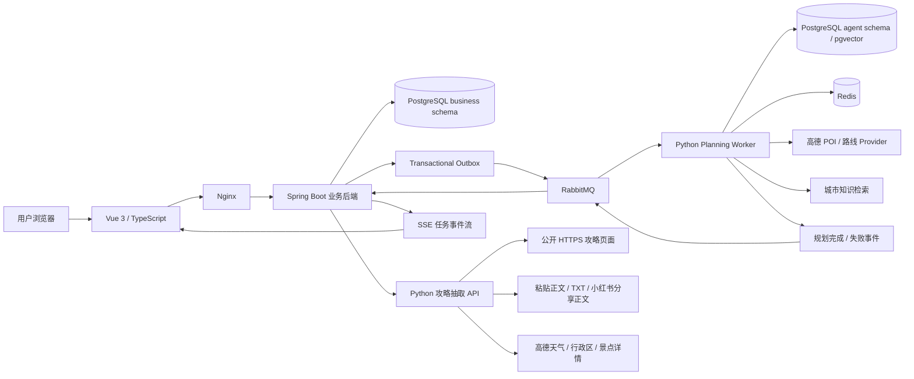
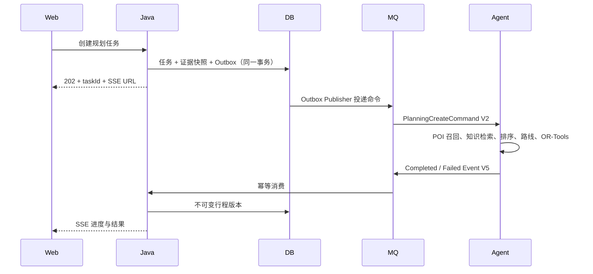

# 当前系统状态、架构汇报与 V1.4 规划

> 盘点日期：2026-07-26
>
> 当前发布版本：V1.2 发布候选
>
> 当前分支：`codex/complete-v1`
>
> 最后已推送提交：`5e01b1a`

## 1. 执行结论

TripPilot 已形成可运行的单城市旅行规划闭环，但“地图可用”和“攻略情报可用”仍有两项
必须如实标记的边界：

1. 高德 JavaScript SDK、路线和 Marker 已加载，生产 CSP 兼容问题已修复；当前本机
   `127.0.0.1:8080` 仍没有获得高德底图数据，最可能是 Web JS Key 域名白名单或安全
   密钥授权问题。地图生命周期加固仍在本地验证，未推送。
2. 当前本地版本已支持公开 HTTPS HTML、粘贴正文、TXT/Markdown 和小红书分享正文，
   并新增城市情报手动同步快照：可获取当前/预报天气、景点地址、坐标、营业和参考消费，事实会
   进入下一次规划快照，雨天会改变室内/室外候选排序。但任意城市的官方文旅网站自动
   发现、官网票价与预约核验、结构化模型抽取仍未完成。

因此，V1.2 可以描述为“规划、编辑、局部重规划和窄范围攻略证据已闭环”；
当前分支已经形成 V1.3 城市情报纵向切片，但在 CI 和官网来源扩展完成前，仍不能
描述为“具备完整城市实时情报 Agent”。

## 2. 当前系统架构



### 2.1 责任边界

| 层/部署单元 | 当前责任 | 数据所有权 |
| --- | --- | --- |
| `apps/web` | 登录、旅行工作台、约束编辑、规划进度、地图、时间轴、攻略界面 | 不持久化业务事实 |
| `apps/travel-server` | 身份、旅行、规划任务、攻略、不可变行程版本、Outbox、SSE | `business` Schema |
| `apps/agent-service` Worker | 候选生成、路线、知识检索、排序、OR-Tools 求解、结果事件 | 计算结果经契约返回 |
| `apps/agent-service` API | 公开攻略抓取、用户正文清洗、城市天气/景点同步和旅行事实抽取 | 当前不拥有旅行级事实 |
| `knowledge` 与采集链路 | 官方来源注册、采集、审核、发布、向量检索 | `agent` Schema |
| PostgreSQL | 业务强一致数据、知识文档、pgvector | 按 Schema 隔离 |
| RabbitMQ | 规划命令、取消命令和结果事件 | 至少一次投递 |
| Redis | Provider 缓存与调用降载 | 可重建缓存 |

### 2.2 规划主链路



### 2.3 当前攻略链路

当前实现：

```text
公开 HTTPS URL
  → SSRF/DNS/重定向/大小校验
  → HTML 正文提取
  → 关键词分类规则
  → guide_import / guide_fact
  → 创建规划任务时生成不可变 guide evidence snapshot
  → Python 候选排序和结果引用
```

目标实现：

```text
城市 + 旅行日期
  ├─ 官方文旅来源
  ├─ 天气 Provider
  ├─ POI/景点详情 Provider（地址、坐标、门票、营业、预约）
  └─ 用户来源（公开 URL、粘贴文本、TXT/Markdown、小红书分享正文）
        ↓
统一文档规范化
        ↓
规则抽取 + 结构化模型抽取 + 证据跨度校验
        ↓
事实可信度、来源等级、checkedAt、TTL、适用日期
        ↓
Java 持久化并生成不可变 planning context snapshot
        ↓
Agent 只使用快照进行候选、排序、约束和解释
```

## 3. 已完成部分

### 3.1 已交付并已推送

- 注册、登录、Refresh Cookie 轮换、退出和用户数据隔离。
- 单城市 1 至 7 天旅行、预算、人数、同行类型、节奏、偏好、固定安排、到返、
  住宿锚点、必去/排除、用餐窗口和行动能力。
- Transactional Outbox、RabbitMQ 规划任务、取消控制通道、SSE 进度和事件补发。
- 高德 POI、步行/车行路线 Provider、Redis 缓存和明确标记的 Demo 降级。
- 候选过滤、近似去重、偏好排序和 OR-Tools 硬约束求解。
- 不可行原因和最小放宽建议。
- 广州静态官方知识来源、采集/审核/发布链路、pgvector 检索、版本化引用和新鲜度。
- 公开 URL 攻略导入、事实持久化、启停、过期过滤、任务证据快照和结果引用。
- 活动删除、移动、锁定、交通方式调整、影响预览和按日期局部重规划。
- 不可变行程版本、知识引用和规划证据持久化。
- Docker Compose 全栈、Prometheus、健康检查、备份恢复脚本和 GitHub Actions。
- Nginx CSP 已兼容高德 SDK，浏览器地图凭据可进入生产构建。

### 3.2 本地验证中、尚未推送

- 地图只在高德基础图块真正完成后再添加路线和 Marker。
- 显式请求高德标准 2D 底图样式。
- 底图超时后切换路线概览，并提示检查域名白名单与安全密钥。
- 对应 Web 回归测试和生产构建已在本机通过。
- 公开 URL、粘贴文本、TXT/Markdown、小红书分享正文统一导入。
- 中文地址、天气、票价、开放时间、预约等事实分类与原句证据。
- “同步城市情报”手动获取高德当前/预报天气和景点地址、坐标、营业、参考消费。
- 当前天气 TTL 为 6 小时、逐日预报 TTL 为 24 小时，只保留与行程日期相交的高德预报；
  每次成功同步会自动停用该行程的旧城市快照，同一行程的并发同步通过行锁串行化。
- 天气事实带 `effectiveDate`，只影响对应日期的室内/室外候选，不再把某一天的雨天规则
  扩散到整个多日行程。
- 城市事实写入 `guide_import` / `guide_fact`，随后进入不可变规划证据快照。
- 雨天事实对室内候选加权、对露天候选降权。
- V18–V19 数据库迁移和 `agent-api` 高德服务端 Key 注入。

地图改动尚未证明当前 Web JS Key 能返回底图，因此在真实底图出现前不应标记为地图问题
完成；攻略与城市情报改动已通过本机门禁，仍需 GitHub CI 复核。

### 3.3 当前运行证据

- 全部 Compose 服务已启动；PostgreSQL、Redis、RabbitMQ、Java、Python API 和
  Prometheus 健康。
- `GET /api/health` 返回 `UP`。
- Web 80 项单元测试、类型检查和生产构建通过。
- Python 389 项通过、34 项按环境跳过，Ruff 静态检查通过。
- Java 162 项通过，V18–V19 迁移与城市同步并发集成测试通过。
- 真实容器 TXT 验收返回 5 类事实；广州城市情报返回 22 条事实并包含天气、景点、
  位置和营业时间。
- 当前地图能绘制路线和 6 个 Marker，但高德底图仍为空。
- 已推送分支和 Draft PR 的最后 CI 证据仍以
  [V1.2 发布验收清单](release-checklist.md)为准。

## 4. 未完成部分

### 4.1 P0 产品缺口

1. **城市动态事实已进入 Agent，但官网覆盖与自动刷新未闭环。**
   - 已支持用户主动同步高德天气和景点详情并进入 Agent，尚未在创建旅行后后台自动刷新。
   - 没有按目的地自动发现和审核各城市官方文旅来源。
   - 官网门票、预约与临时闭馆信息尚未和高德信息做冲突核验。
2. **多来源攻略已贯通，但规范化仍需增强。**
   - 已支持 URL、正文粘贴、TXT/Markdown 和小红书分享正文。
   - 不登录或绕过反自动化抓取受限页面；这仍是明确边界。
   - 文件目前限制为 UTF-8 文本和 100 KB，尚未支持 PDF、图片 OCR。
3. **事实抽取仍以规则为主。**
   - 常见中文地址、票价、时间、预约、天气已可识别并保留原句证据。
   - 无事实时已返回具体的可补充字段提示，不再使用原来的笼统提示。
   - 仍缺少受 Schema 限制的结构化模型抽取、字段级数值校验和冲突解释。
4. **地图底图授权未闭环。**
   - 当前浏览器地址未获得有效底图数据。
   - 需要在高德控制台核对 Web JS Key 类型、匹配的 `securityJsCode` 和域名白名单。
5. **行程版本尚未产品化。**
   - 数据层有不可变版本，但用户不能查看差异或回滚。

### 4.2 P1 工程与运营缺口

- 缺少真实浏览器跨服务 E2E 门禁。
- 缺少规划成功率、Provider 延迟/错误、配额、缓存命中、队列积压和事实新鲜度指标。
- 缺少死信查看、失败诊断和幂等重放操作面。
- Java、Python、TypeScript 契约仍需要手工保持同步。
- `TripDetail.vue`、部分 Provider 和 Repository 职责过大。
- 缺少只读分享、PDF/日历导出和移动弱网离线查看。

## 5. 下一部分应该做什么

建议立即把下一阶段定义为 **“可信城市情报最小纵向切片”**，优先级高于分享、导出和
多方案比较。

### 5.1 第一批：完成官方来源注册与可靠性分级

当前已经区分：

- `OFFICIAL_TOURISM_URL`
- `OFFICIAL_ATTRACTION_URL`
- `WEATHER_PROVIDER`
- `PUBLIC_GUIDE_URL`
- `PASTED_TEXT`
- `TEXT_FILE`
- `XIAOHONGSHU_SHARED_TEXT`
- `CITY_INTELLIGENCE`

小红书支持范围限定为用户主动提供的分享正文、公开页面或导出 TXT；不保存登录 Cookie，
不绕过验证码和平台访问限制。

下一步应补充 `OFFICIAL_TOURISM_URL` / `OFFICIAL_ATTRACTION_URL` 的持久化来源等级，
把当前广州静态注册表扩展为可审核的多城市目录。

### 5.2 第二批：结构化抽取与冲突核验

按职责拆分：

1. `DocumentNormalizer`：现有 HTML、纯文本、TXT/Markdown、分享文本继续拆出独立端口。
2. `RuleFactExtractor`：保留现有票价、时间、地址、交通、天气和预约规则。
3. `StructuredModelFactExtractor`：输出受 Schema 限制的候选事实。
4. `FactValidator`：验证类别、长度、时间、金额、坐标、证据跨度和来源。
5. `FactMerger`：去重并处理官方/社区冲突。

每条事实必须保留：

- `category`
- `statement`
- `evidence`
- `sourceType`
- `reliabilityLevel`
- `observedAt` / `checkedAt` / `expiresAt`
- 可选的 `price`、`coordinates`、`openingHours`、`reservationRequired`

### 5.3 第三批：把城市同步变成自动刷新

- 根据 `destination` 选择来源注册表，而不是只初始化广州固定语料。
- 现有高德天气/景点同步改为创建旅行后异步预热、开始规划前按 TTL 自动复核。
- 景点详情继续返回 POI ID、地址、坐标、营业时间和参考消费；门票/预约必须由官网核验。
- 官方来源抓取失败时保留最后成功快照并明确标记过期，不能伪装成实时。

### 5.4 第四批：进入 Agent 判断

- Java 在创建任务时冻结 `cityIntelligenceSnapshot`。
- Python 只消费快照，不在求解途中直接抓网页。
- 官方且新鲜的关闭/预约事实可以形成硬约束。
- 社区攻略和小红书事实只影响候选排序、软建议和解释。
- 结果页显示实际使用的事实、来源和核验时间。

## 6. 未来两个版本规划

### V1.3：可信城市情报与可恢复版本

目标：让 Agent 真正理解“这个城市当前能怎么玩”，并能说明依据。

必须交付：

- 多来源导入：公开 URL、粘贴正文、TXT/Markdown、小红书分享正文。
- 规则 + 结构化模型的事实抽取和证据校验。
- 自动按城市加载官方文旅、天气和景点详情。
- 动态事实 `checkedAt`、TTL、来源等级和冲突合并。
- 动态事实与用户攻略一起进入不可变规划上下文。
- 攻略删除、重新核验、失败保留最后成功快照。
- 行程版本列表、差异和回滚。
- 地图真实底图在本地和正式域名均通过浏览器验证。

V1.3 退出标准：

- 广州之外至少再支持两个城市的官方来源配置。
- 一份包含门票、地址、时间和天气的中文 TXT 能提取出带证据的事实。
- 一份小红书分享正文可以被规范化并提取社区事实。
- 无事实时返回可解释原因，而不是笼统提示。
- 规划结果能展示至少一条实际影响排序或约束的城市情报。

### V1.4：产品分发与生产运营闭环

目标：把可信规划能力变成可持续运营、可分享、可恢复的产品。

必须交付：

- 轻松/均衡/密集或预算差异的多方案生成与解释对比。
- 只读分享链接、撤销和访问限流。
- PDF、日历导出和移动端离线只读。
- 浏览器—Java—RabbitMQ—Python—PostgreSQL—SSE 跨服务 E2E。
- 规划与情报 SLI、Provider 健康度、配额、告警和 Trace。
- 死信与失败任务的受保护诊断、审计和幂等重放。
- JSON Schema 驱动的跨语言契约校验或代码生成。
- 大组件和大适配器按用例、领域与基础设施边界拆分。

V1.4 退出标准：

- 核心用户旅程有跨服务浏览器自动化门禁。
- Provider 故障、知识过期和消息重放均有演练证据。
- 匿名分享不暴露可变旅行对象或用户隐私。
- 生产 HTTPS、备份恢复、告警和不可变镜像回滚形成发布记录。

## 7. 架构建议

1. 不要把官网抓取、天气 API 和用户文本解析直接塞进规划 Worker；它们应先形成可审计
   事实快照，保持规划计算确定性。
2. Java 继续拥有旅行级事实和任务快照；Python 负责采集、抽取和规划计算，不反向拥有
   用户业务状态。
3. 官方事实和社区事实必须分级。社区内容不能直接关闭景点、改变票价或形成硬约束。
4. 抽取模型输出只能是候选事实，必须经过 Schema、证据跨度、TTL 和来源校验后才能持久化。
5. 优先完成一条可测试的城市情报纵向切片，再扩展城市数量；不要先建设大而全的爬虫平台。
6. 地图 Key、天气 Key、Web Service Key 和模型凭据必须分用途管理并在启动时校验，避免
   “配置存在但权限不匹配”的静默失败。
