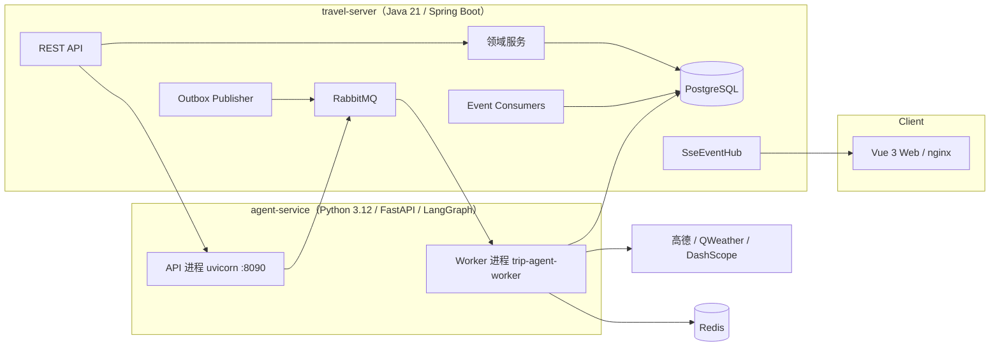

# 系统架构

- 文档状态：生效中（基于当前代码）
- 相关文档：[开发指南](development.md) · [运行与运维](operations.md) · [架构决策记录](decisions.md)

## 1. 总览

TripPilot 由三个应用与一组基础设施组成，通过 RabbitMQ 解耦同步 API 与长时间规划任务：



- **travel-server（Java）**：用户/认证、行程、约束、版本、分享、导出、攻略情报投影、知识库管理的唯一权威。拥有事务性 Outbox、事件消费者幂等、SSE 推送。
- **agent-service（Python）**：两个进程共用一个镜像——Worker 进程（`trip-agent-worker`）消费规划命令与 Agent 对话命令、执行规划管线；API 进程（uvicorn，内部端口 8090）提供健康检查与内部诊断端点。
- **web**：nginx 托管静态产物并反代 `/api` 到 travel-server。
- **knowledge-init**：一次性任务，建知识库表并导入 `knowledge/` 语料后退出（`service_completed_successfully`）。

## 2. 规划管线（确定性内核）

权威行程只由这条管线产生，每一步都是确定性代码：

```text
用户约束（结构化）
  → 约束归一化
  → 候选检索（Provider POI + 证据分档：可靠性 × 新鲜度）
  → Provider 富化（营业时间、地址、区域）
  → 可行性过滤（硬过滤：地址缺失/城市不符/重复/AVOID，reason 为 Literal 类型）
  → 调度优化（日型分类、锚点先置、餐位时间预留；
     日内选择：贪心 / CP-SAT / SHADOW，见 §4）
  → 交通规划（确定性规则表：预算/天气/无障碍 → 交通容差）
  → 硬校验（11 条规则 + 有界修复，三态结论）
  → 行程持久化（事件回写 Java 落库）
```

硬校验规则（`feasibility/validator.py`）：TRIP_DATE_RANGE、BUDGET_LIMIT、MUST_VISIT_COVERAGE、OPENING_HOURS、MEAL_WINDOW 等 11 条，纯函数实现，结论带 `report_id` 可追溯。校验不过的候选永远不会成为正式版本。

## 3. Agent 边界（有界会话层）

Agent 编排层（`apps/agent-service/src/trip_agent/agent/`）的核心原则：**模型提议，代码裁决**。

- **图结构**：LangGraph 三节点 `decide → act → finish`，`act` 后回到 `decide` 成环。
- **三重硬上限**：`MAX_STEPS=8`、`MAX_TOOL_CALLS=16`、`MAX_LLM_CALLS=8`，触顶即停。
- **工具只有 5 个**：`update_constraints` / `ask_user` / `update_preferences` / `build_itinerary` / `validate_itinerary`，以 `ToolSpec` + JSON Schema 声明。**没有 emit 工具**——校验通过且评估 ACCEPT 时，编排层自动发射行程（stop_reason=EMITTED）。
- **槽位三态与证据确认**：约束槽位状态为 UNKNOWN / INFERRED / CONFIRMED / REJECTED / USER_OVERRIDE；LLM 提议的值只有在用户原话 evidence 中出现才升为 CONFIRMED，只有 CONFIRMED / USER_OVERRIDE 才能成为硬约束。
- **失败工程**：纯函数失败分类（TRANSIENT / USER_CONSTRAINT / FEASIBILITY / VALIDATION / INTERNAL）、确定性失败签名与重复升级、反思预算 3 次、AgentState checkpoint 版本化（未知版本 fail-closed）。
- **决策器双模式**：未配置模型时为确定性 `AskingDecider`（正则提取槽位、绝不发明值）；配置 `STRUCTURED_MODEL_*` 后为 LLM 决策 + JSON Schema 严格结构化输出，解析失败降级回确定性策略而不是崩溃。`/health` 如实报告当前形态（DETERMINISTIC / STRUCTURED）。
- **记忆分层**：Working（AgentState + Redis checkpoint）→ Episodic（agent_run / agent_step 轨迹表）→ Semantic（pgvector 知识库）→ Profile（用户确认后的旅行偏好）。
- **可恢复中断**：WAITING_USER 状态带 TTL 过期，回答后经 AGENT_RESUME 继续，运行幂等防双执行。

## 4. 日内调度：贪心 / CP-SAT / SHADOW

环境变量 `PLANNING_DAY_SCHEDULER`（默认 GREEDY）：

- `GREEDY`：确定性贪心内核，默认路径。
- `CPSAT`：OR-Tools CP-SAT 精确选择（固定 seed、单 worker、默认 5 秒时限），任何失败自动回退贪心——"可以变慢，不能变坏"。
- `SHADOW`：贪心结果权威返回，CP-SAT 并行跑、仅日志对比，用于积累切换证据。

对照基准（10 个确定性场景，含结论表）：[apps/agent-service/benchmarks/scheduler/README.md](../apps/agent-service/benchmarks/scheduler/README.md)。

## 5. 异步链路与消息可靠性

```text
Web → Java REST（同步，毫秒级返回任务受理）
    → 事务性 Outbox（业务数据与事件同一事务落库）
    → OutboxPublisherJob 批量发布 RabbitMQ（at-least-once）
    → Python Worker 消费（按 command_event_id 幂等）
    → 规划/Agent 执行 → 发布事件族（PROGRESS / COMPLETED / FAILED / REVIEW_REQUIRED / AGENT_*）
    → Java 事件消费者（eventId 幂等落库）
    → SSE 推送前端（订阅时先回放持久化历史，支持 Last-Event-ID 断线续传）
```

- **Outbox**：`OutboxPublisherJob` 轮询，`OutboxPublicationService` 单批 50 条，每次发布记录 publication attempt。
- **SSE**：`SseEventHub` 统一管理 agent-dialog 与 planning-task 两条流的 emitter 生命周期——256 条 striped monitor、订阅回放、终态事件完成即释放。
- **失败归宿**：消费失败进死信队列；规划失败以 FAILED 事件回写并显式呈现，不存在"静默卡住"的运行。

## 6. 契约（Java ↔ Python）

- `contracts/messaging/` 下 **22 个 JSON Schema** 是跨语言消息的权威定义，带版本演进（如 planning-completed-event v9→v11 并存，消费侧按 schema_version 分派）。
- `contracts/fixtures/` 提供两侧测试共用的样例消息。
- Java 侧每类事件/命令有独立 Parser（金额精度、URL、枚举等契约原语收敛在 `ItineraryContractValidator`），Python 侧有对应契约测试与 pydantic wire 模型（schemaVersion v2–v4）。

## 7. 数据

- **PostgreSQL**（business schema）：用户、行程、约束、不可变版本（`itinerary_version`）、transit legs、攻略情报、Agent 轨迹（agent_run / agent_step）、偏好 profile；**45 个 Flyway 迁移**管理演进。
- **PostGIS / pgvector**：空间数据与知识库向量检索。
- **Redis**：Agent checkpoint、运行时缓存（TTL 必须为正，配置错误响亮失败）。
- **Provider 抽象**：`PlanningProvider` 协议 + 15 类错误分类学（retryable / fallback_allowed）+ `ProviderFallbackPolicy`；AMap 凭据日志自动脱敏；抓取层强制 HTTPS 并拒绝非公网 IP（防 SSRF）。

## 8. 前端

- Vue 3 `<script setup>` + TypeScript strict（构建门禁含 vue-tsc），Pinia store 分 auth / session / trip 三个域。
- API 层统一 `request<T>` 封装（`lib/api.ts`），含手写 SSE 解析器（逐块缓冲、Last-Event-ID 续传）；401 走单飞 refresh + 代际保护。
- 高德 JS API 单例加载器：五态生命周期（idle/loading/ready/fallback/error），无 Key 时降级为纯 SVG 投影图。
- Agent 对话由 `useAgentWorkspace` 状态机驱动：SSE 重连上限 3 次、首事件 90 秒兜底超时，"没有事件就没有阶段"，不做假进度。
