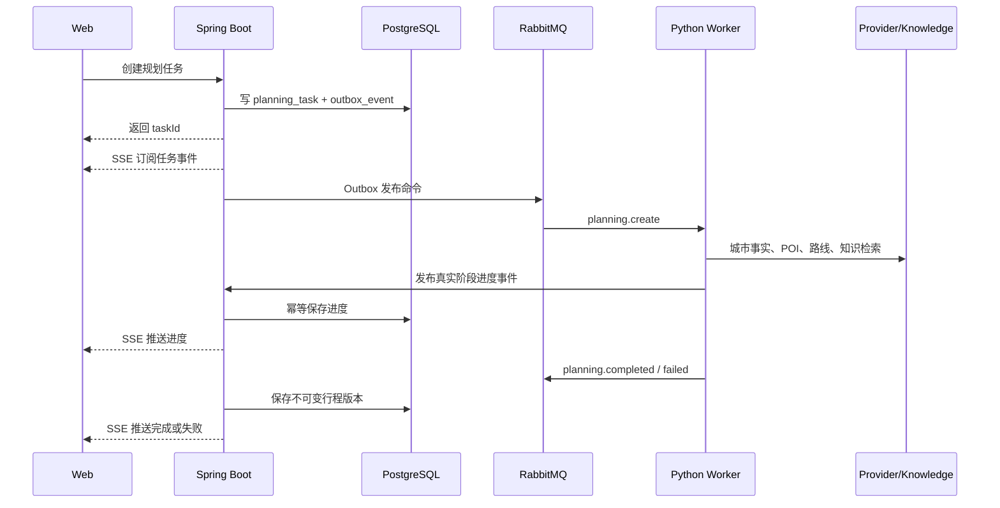

# 系统架构

TripPilot 是三服务 Monorepo：Vue Web、Spring Boot 业务后端和 Python Agent Service。系统保持模块化单体的事务边界，同时把规划、Provider 调用和文本处理放到 Python 侧。

## 服务职责

| 服务 | 职责 |
| --- | --- |
| `apps/web` | 登录、旅行工作台、规划进度、质量评估、地图概览、版本、分享和导出入口 |
| `apps/travel-server` | 身份、旅行、约束、规划任务、质量元数据持久化、安全、Outbox、SSE、诊断和导出 |
| `apps/agent-service` | 攻略抽取、城市知识处理、POI/路线 Provider、候选排序、约束求解、确定性质量评估和消息消费 |
| `contracts` | Java、Python 和 TypeScript 共享的版本化消息契约 |
| `knowledge` | 城市知识 Markdown、来源注册和固定评测语料 |
| `infra` | 数据库扩展、Prometheus 配置和运行基础设施 |

## 运行链路



## 领域边界

- Identity：用户、JWT Access Token、HttpOnly Refresh Cookie 和会话轮换。
- Trip：旅行基础信息、结构化约束（目的地行政区 + POI 锚点 + 到返时间 + 三餐 + 偏好）、归档状态和用户所有权。
- Planning：任务状态、幂等键、取消、进度事件和失败诊断。
- Itinerary：不可变版本、天、活动、交通段、编辑、差异和回滚。
- Knowledge：城市知识文档、片段、嵌入和检索结果。
- City Intelligence：来源注册、事实抽取、审核、合并、新鲜度和规划快照。
- Share/Export：固定版本的匿名只读分享、PDF 和 ICS。

Java 拥有用户可见业务事实和事务一致性；Python 只消费冻结输入、产出规划事件和候选结果。Worker 不直接修改用户业务表。

### 旅行约束与地点搜索

权威需求基线见 [`docs/architecture/trip-constraints-and-place-search.md`](architecture/trip-constraints-and-place-search.md)。领域边界：

- **DestinationRegion ≠ StructuredPoi**。`DestinationRegion`（省/市/区县，adcode）负责旅行规划范围；`StructuredPoi`（provider、providerPoiId、坐标、地址、类别码）负责精确路线锚点。
- 目的地使用静态行政区数据（`trip/RegionCatalog.java`、`apps/web/src/lib/china-divisions.ts`），级联选择，禁止自由文本伪造权威目的地。
- 到达/返程/酒店必须是联想列表选中的 POI；后端按场景类别码（交通 `150*`、住宿 `100*`）重新校验，未选中的自由文本不得成为可信锚点。
- 到达/返程保存完整 `OffsetDateTime`（业务时区 `Asia/Shanghai`），锚点日期必须在行程范围内、返程晚于到达。
- 三餐默认 `08:00–09:00 / 12:00–13:00 / 18:00–19:00`，来源 `SYSTEM_DEFAULT`/`USER_SET`。
- 创建与编辑共用同一约束模型；`PUT /api/trips/{tripId}/configuration` 原子更新配置。
- 地点搜索经 Java 受限代理（`GET /api/places/search`、`/api/places/suggest`），浏览器不直接持有 AMap Key；失败 fail-closed。
- 业务时区 `Asia/Shanghai`，可注入 `Clock`，`GET /api/system/time` 向浏览器提供北京日历锚点。

## 数据所有权

| 存储 | 所有者 | 内容 |
| --- | --- | --- |
| PostgreSQL `business` schema | Java | 用户、旅行、约束、任务、事件、行程版本、分享、诊断和审计 |
| PostgreSQL `agent` schema | Python | 知识文档、嵌入、Agent 运行记录和评测数据 |
| Redis | Java/Python | Provider 缓存、短期协调和运行时缓存 |
| RabbitMQ | Java/Python | 规划命令、取消、进度、完成、失败和死信消息 |

稳定、需要查询或需要约束的数据关系化；结构会演进且仅在单次流程内消费的数据可以使用 JSONB。行程版本、规划快照和分享目标都不可变。

## 可靠性模型

Provider 执行链为：

```text
WorkerSettings
  -> build_planning_provider
  -> DemoPlanningProvider | AmapPlanningProvider
  -> RetryingMapProvider / RetryingRouteProvider
  -> ProviderFallbackPolicy（仅显式 fallback 模式）
  -> PlannerPipeline
  -> Worker completion v6 | failure v2
  -> Java parser/consumer -> task event -> SSE/API
```

- Transactional Outbox 保证数据库写入和消息发布最终一致。
- RabbitMQ 使用 at-least-once 投递；消费者用任务、消息和序列号做幂等。
- 规划任务状态只允许 `QUEUED -> RUNNING -> COMPLETED/FAILED/CANCELLED`。
- SSE 事件持久化到数据库，浏览器通过 `Last-Event-ID` 补发遗漏事件。
- 同一旅行只允许一个修改行程的活动任务，避免并发覆盖当前版本。
- 回滚不修改历史版本，而是复制目标版本并创建新的 `ROLLBACK` 版本。
- `DEMO_ONLY` 完全不创建 AMap；`REAL_ONLY` 完全不创建 Demo/fallback；`REAL_WITH_EXPLICIT_FALLBACK` 才创建两者，并由集中白名单按 category、operation 与 retry exhaustion 判定。
- `RATE_LIMITED`、`TIMEOUT`、`NETWORK_ERROR`、`PROVIDER_UNAVAILABLE` 和部分 `MALFORMED_RESPONSE` 在单一执行层有限重试；配置、鉴权、权限、配额、无效请求、Adapter 与内部错误默认不重试。
- 显式 route 回退必须标记目标 Transit 为 `DEMO/estimated`，顶层来源聚合为 `MIXED` 并记录原因/关联 ID；`REAL_ONLY` 错误发布 failure v2，不能转换为成功。
- `PlanningResult` 是成功 provenance 的唯一事实来源。completion v6 通过可选对象传递 requested/primary/actual providers 与结构化 fallback operation；Java 不扫描结果补造 mode 或 fallback。
- 新版本中的 Activity/Transit 使用数据库 UUID。完成事务按消息内稳定 ID 重映射 Route operation 后，将同一 JSONB 用于任务查询和 SSE 回放；历史 v6 无 provenance 时保持未记录。该路径复用 `planning_task_event.payload`，Flyway 仍为 V27。
- `PlanEvaluator` 在成功消息发布前以纯规则读取冻结 command 与 `PlanningResult`，生成五维评分、warning 和 evidence-backed decision。硬约束违规转为 `DATA_QUALITY_ERROR`，不发布伪成功；evaluation 与 fallback operation 的实体 ID 在终态事件落库前一起重映射，GET/SSE/回放读取同一 JSONB。
- AMap 严格真实模式由 `PROVIDER_MODE=REAL_ONLY` 选择，服务端使用 `AMAP_WEB_SERVICE_KEY`，浏览器地图使用独立的 `VITE_AMAP_WEB_JS_KEY`/`VITE_AMAP_SECURITY_CODE`。
- 当前真实验收覆盖广州 POI、步行和驾车路线；不把未验证的公交路线或公网域名能力推断为已交付。

## 规划流程

标准阶段由 Worker 产生并经 Java 持久化：

```text
TASK_ACCEPTED
CONTEXT_VALIDATING
CITY_FACTS_LOADING
POI_RECALLING
KNOWLEDGE_RETRIEVING
CANDIDATES_RANKING
ROUTES_CALCULATING
CONSTRAINTS_SOLVING
RESULT_EXPLAINING
RESULT_PERSISTING
COMPLETED
```

规划使用三段式思路：候选过滤、偏好排序、约束求解。硬约束包括必去地点、到返时间、预约时间、预算硬上限和锁定活动；软约束包括偏好、步行、节奏和预算期望。可信官方事实可以形成硬约束，社区或过期事实只能影响排序、提示和解释。

## 安全与合规

- Refresh Token 只通过 HttpOnly Cookie 传输，不进入 JavaScript。
- 所有用户数据按所有权校验隔离。
- 攻略 URL 经过公开 HTTPS、DNS 公网地址、同域重定向和响应大小限制检查。
- 系统不会登录站点、绕过验证码或批量爬取账号内容。
- 真实 Token、Cookie、Provider Key、模型 Key 和完整攻略正文不得进入日志。
- 内部诊断入口必须使用强随机令牌保护，且只暴露脱敏上下文。

## 可观测性

Prometheus 覆盖规划成功/失败/取消、阶段耗时、Provider 结果、RabbitMQ 积压和任务结果。关键日志携带 `traceId`、`tripId`、`taskId`、`messageId` 和 `provider` 等非敏感标识。Provider 回退使用稳定标记 `planning_provider_fallback`，并记录 operation、reason、retry_count、event_id、trace_id、task_id 和 trip_id；密钥、Cookie、Authorization 和完整 payload 不进入日志。

## 历史详稿

原始长文档已归档，保留更多背景和旧版细节：

- [原系统架构详稿](archive/architecture.md)
- [领域模型详稿](archive/domain.md)
- [数据库设计详稿](archive/database.md)
- [规划算法详稿](archive/planning.md)
- [架构重构记录](archive/architecture-refactoring-plan.md)
