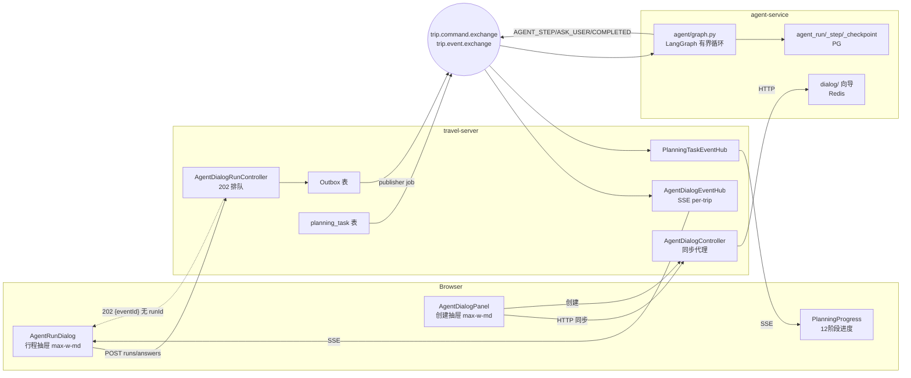
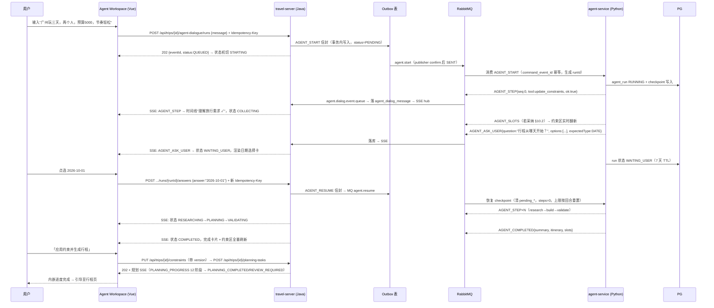

# TripPilot Agent UX 2.0 — Agent Workspace 重构方案（评审稿）

- 状态：**已批准实施（2026-08-30）— Phase A/C/B/D 核心已落地，E/F 复用既有管线**
- 日期：2026-08-30
- 审计范围：`apps/web`（全部 30+ 组件与 SSE 层）、`apps/agent-service/src/trip_agent`（agent/ worker/ dialog/ 全量）、`apps/travel-server`（agentdialog/ + MQ + SSE + 持久化）、`contracts/messaging`（33 份 schema）、既有 ADR 与架构文档
- 关联文档：[ADR-016 Agent对话传输边界](../adr/Agent对话传输边界.md)、[Agent化升级技术设计方案](Agent化升级技术设计方案.md)、[事件契约](事件契约.md)、[Agent化路线图](../product/Agent化路线图.md)

---

## 0. 结论摘要

1. **后端 Agent Runtime 已具备「步骤级真实事件」能力**，但只有 3 种事件到达前端：`AGENT_STEP`（逐工具步）、`AGENT_ASK_USER`（澄清问题）、`AGENT_COMPLETED`（行程+约束投影）。UI 重设计必须也只能建立在这 3 种事件之上。
2. **最大的断层不是"事件不够多"，而是"终态没有事件"**：run 以 `STOPPED`（循环上限触顶）、`EXPIRED`（7 天等待 TTL）、resume 被拒（运行中/终态/无 checkpoint）结束时，Python 侧**一条事件都不发布**（`agent_processor.py:199-200,285-286` 只在 `WAITING_USER`/`EMITTED` 时发布）。用户看到的是永远的"助手正在思考…"。这是本次唯一必须新增的契约（`AGENT_RUN_FINISHED`）。
3. 当前 UI 的问题不是"不够漂亮"，而是**产品形态错了**：两个并行且互不相识的聊天抽屉（创建模式走 HTTP wizard、行程内走 MQ run），把 Agent 退化成 ChatGPT 式气泡流，约束状态、执行进度、等待状态全部不可感知。
4. 新方向：**AI Travel Agent Workspace**——单一工作台外壳，三区结构（阶段状态条 / 对话+执行时间线 / 约束工作区），所有 UI 状态由真实事件与真实 run 状态投影而来，**零 Fake Progress**。
5. 后端改动被刻意压到最小：1 个必须的 P0 事件契约（`AGENT_RUN_FINISHED`）+ 1 个建议的 Phase B 契约（`AGENT_SLOTS`），其余全部复用现有 REST/SSE/MQ 契约。REPLAN 复用既有确定性重规划管线（`POST /api/trips/{id}/itinerary/replans` + 12 阶段进度流），**不在 Agent 循环里伪造 REPLAN**。

---

## 1. 当前架构审计

### 1.1 Agent Runtime 现状：两条并行通道

审计确认系统内存在**两套互不相识的 Agent 对话运行时**，服务两个不同产品阶段：

| | 通道 A：HTTP 对话向导（创建模式） | 通道 B：MQ Agent Run（行程内） |
|---|---|---|
| 运行时 | `trip_agent/dialog/`（确定性槽位向导 + 可选 LLM 抽取，Redis 存储 TTL 7 天） | `trip_agent/agent/graph.py`（LangGraph 有界循环 + LLM 决策器）+ `worker/agent_processor.py` |
| 入口 | `POST /api/agent/dialogue`、`POST /api/agent/trips`（Java 同步代理 `HttpAgentDialogClient`） | `POST /api/trips/{id}/agent-dialogue/runs`（202 排队）、`POST .../runs/{runId}/answers`（202 排队） |
| 传输 | 同步 HTTP，每次调用返回全量转录 `DialogueResponse{phase, ready, messages, slots}` | 事务性 Outbox → `trip.command.exchange`（`agent.start`/`agent.resume`）→ Python → `trip.event.exchange` → Java 落库 → SSE |
| 前端载体 | `AgentDialogPanel.vue`（TripDashboard「AI 帮我规划」入口） | `AgentRunDialog.vue`（TripDetail「AI 助手」入口） |
| 约束表达 | **最丰富**：`SlotView{value, state: UNKNOWN\|INFERRED\|CONFIRMED, source: TRIP\|USER_EXPLICIT\|USER_CONFIRMED\|LLM_INFERRED}` + `CardOption{action: SET\|CONFIRM\|EDIT\|SKIP\|ASK}` | 运行中无约束视图；仅 `AGENT_COMPLETED` 附带 `slots{name:{value,state}}` |
| 执行可见性 | 无（向导无步骤概念） | `AGENT_STEP{seq, tool, ok, summary, errorCode}`，逐工具步，`ask_user` 被有意排除 |
| 持久化 | Redis `agent:dialog:*`（7 天 TTL，内存兜底） | PG：`agent.agent_run`（command_event_id 唯一索引防重）、`agent.agent_step`、`agent.agent_checkpoint`（版本化全量状态）；Java 侧 `business.agent_dialog_message`（SSE 事件日志，Last-Event-ID 重放源） |

通道 B 的 LangGraph 拓扑（`graph.py:363-376`）：`START → decide ⇄ act → finish → END`，有界上限 `MAX_STEPS=8 / MAX_TOOL_CALLS=16 / MAX_LLM_CALLS=8`（每回合重置，`agent_processor.py:263-277`）。决策器二选一（`factory.py`）：配置了 `STRUCTURED_MODEL_*` 走 LLM 结构化决策，否则退化确定性 `AskingDecider`。

**策略事实（审计纠正）**：决策 schema 中的策略枚举是 `DIRECT | RETRIEVE | CLARIFY | REPLAN`（`graph.py:219-244`），**没有 RESEARCH**；`REPLAN` 只是"可声明"，循环内没有任何工具能修改既有行程（`itinerary_builder` 只会新建候选），真正能落地的"改行程"走的是通道外的确定性重规划管线。`USER_OVERRIDE` 在 `state.py:22-36` 五态中真实存在（技术设计文档曾提议砍掉，代码保留了）。

### 1.2 事件契约现状（真实清单）

Python → Java → SSE 的全部 Agent 事件（`worker/contracts.py:1640-1812`，schema 见 `contracts/messaging/agent-*-v1.schema.json`，跨语言 fixture 钉死）：

| 事件 | Routing Key | Payload（逐字字段） | 触发条件 |
|---|---|---|---|
| `AGENT_STEP` | `agent.step` | `{seq≥0, tool(1..60), ok, summary(1..300), errorCode?}` | 每个新工具观测（checkpoint sink，`agent_processor.py:290-338`）；`ask_user` 排除 |
| `AGENT_ASK_USER` | `agent.ask-user` | `{question(1..300), options?(≤10 个字符串), expectedType?: TEXT\|NUMBER\|DATE\|CHOICE}` | `stop_reason=="WAITING_USER"` 且有 pending_question |
| `AGENT_COMPLETED` | `agent.completed` | `{summary, itinerary(wire), slots?: {name:{value,state}}}` | `stop_reason=="EMITTED"` 且有候选行程 |

**没有的事件**（这是本方案所有契约建议的出发点）：
- 终态事件：`STOPPED`（上限触顶/LLM 预算耗尽）、`EXPIRED`、resume 被拒（`RUN_UNKNOWN/RUN_EXPIRED/RUN_IN_PROGRESS/RUN_TERMINAL/NO_CHECKPOINT`）全部静默（`agent_processor.py:71-80` 定义拒绝原因后直接 reject 进死信，无事件）。
- 运行中约束投影事件：`update_constraints` 成功后 slots 变化只存在于 checkpoint，前端在 `AGENT_COMPLETED` 之前看不到任何结构化约束状态。
- run 启动确认事件：202 响应只回 `{eventId, status:"QUEUED"}`（`AgentDialogRunController.java:40-53`），**runId 由 Python 消费时才生成**，前端只能靠 SSE 重放拿到 runId。

Java 消费侧（`infrastructure/mq/AgentDialogEventListener.java`）：按 `eventType` 字符串分发，**未知事件类型直接 `AmqpRejectAndDontRequeueException` 进死信**——这决定了任何新事件必须同步改 Java（parser + listener case + 队列绑定 + `agent.dialog.event.queue` 路由契约测试 `RabbitMessagingRoutingContractTest`）。

SSE 层（`AgentDialogEventHub.java`）：per-trip 订阅、30 分钟超时、**无心跳**、连接即从 `business.agent_dialog_message` 重放历史（`Last-Event-ID` = 自增 id）、收到 `AGENT_COMPLETED` 也不关流（对话可继续）。前端手写 fetch 流解析器（`api.ts:1257-1319`），不读 SSE `event:` 字段，eventType 从 JSON data 内取。

### 1.3 前端 UI 现状

- **两个右抽屉**（都是 `fixed inset-y-0 right-0 max-w-md`，Teleport 到 body，标题都叫"AI 行程助手"）：`AgentDialogPanel.vue`（212 行）与 `AgentRunDialog.vue`（353 行）。布局模型是纯聊天气泡流 + 底部输入框，正是"ChatGPT 式"形态。
- `AgentRunDialog` 的时间线现状：`AGENT_STEP` 渲染为一行等宽字体小字，**直接显示 `tool` 原始名**（如 `update_constraints`）——技术概念泄漏给普通用户。
- 澄清应答降级：`AgentRunDialog.vue:122-126` 里点击选项按钮只是**把文本填进输入框再当自由文本发送**——契约里有结构化机会（`expectedType`）但完全没用上。
- 状态全部组件局部 + prop drilling：TripWorkspace.vue（1395 行）用 ~45 个 props 把规划/行程/Agent 状态传给 TripDetail；Pinia 只有一个 auth store。
- 错误直通：两个面板把后端 `cause.message` 原文渲染（`AgentDialogPanel.vue:76`、`AgentRunDialog.vue:129`），`TripWorkspace.errorMessage()` 未映射的 code 原样透传（`TripWorkspace.vue:151`）——"Agent dialog service rejected the request"（`HttpAgentDialogClient.java:90`，502 `AGENT_DIALOGUE_UNAVAILABLE`）即由此直达用户。
- **真 bug**：`AgentRunDialog.vue:154-180` 应用约束到行程时构造的 `UpdateTripConstraintsInput` 缺必需的 `version` 字段（乐观锁），且只映射 6 个槽位（日期/目的地/住宿/抵离锚点全被丢弃）。
- 用户消息不重放：重开面板后历史里的用户发言消失（仅本地 push，`AgentRunDialog.vue:99-120`）。
- 行程内已有丰富的**确定性规划进度 UI**（`PlanningProgress.vue`，12 阶段白名单 + SSE `PLANNING_PROGRESS` + 终态短路器 `planning-stream.ts`）——Agent Workspace 应当复用而不是另造。
- 设计系统：Tailwind 3.4 + 自定义主题（primary 珊瑚红 / surface 暖色系）、`ui/{Button,Badge,Card,Dialog}` 原语、`lucide-vue-next` 图标；`radix-vue/framer-motion` 已装未用。无 i18n、无暗色主题、移动端仅靠断点类。
- e2e 对 Agent 对话**零覆盖**；单测 `AgentRunDialog.test.ts` 钉住了 start/resume/step/completed/apply 过滤行为。

### 1.4 约束流现状

两套约束表达并存：

1. **Trip 持久约束**（权威）：`business` 库 Trip + TripConstraint（`TripConstraintRecord`：预算/人数/类型/节奏/偏好/固定安排/抵离锚点/住宿/必去/排除/三餐窗/行动能力），经 `PUT /api/trips/{id}/constraints`（乐观锁 version）修改。
2. **Agent 槽位**（对话态）：通道 A 的 `SlotView{value,state,source}`（state∈UNKNOWN/INFERRED/CONFIRMED，source 含 TRIP 锁定态）；通道 B 的五态 `SlotState`（+REJECTED/USER_OVERRIDE）。`update_constraints` 工具的 provenance 由代码裁定（`rule:evidence-match`：证据文本包含该值才 CONFIRMED，否则 INFERRED；改已定值→USER_OVERRIDE；被拒值再提议被拒收）。

两者的桥接：`AGENT_COMPLETED.slots` → 前端映射（CONFIRMED only）→ `PUT constraints` → `POST planning-tasks`（确定性管线）。规划管线的约束求解由 OR-Tools 内核完成，其结果经 `PLANNING_COMPLETED`（v11，含 feasibility_report + evaluation）或 `PLANNING_REVIEW_REQUIRED`（v2）回传——**这条流有完备的 SSE + 进度 UI**。

### 1.5 现状结构图



### 1.6 需求假设与代码事实的差异（评审需知）

| 需求文档假设 | 代码事实 | 处置 |
|---|---|---|
| 策略含 RESEARCH | 枚举为 `RETRIEVE`（`graph.py:242-244`） | UI 层"查询信息"阶段由 `retrieve_guide_knowledge/search_place/get_route/check_opening_hours` 步骤聚合而来，不依赖策略名 |
| WAITING_USER 需设计 resume UX | 机制完备（7 天 TTL、600s 陈旧恢复、checkpoint、防重） | 纯 UI 工作 + 终态事件补齐 |
| ask_user 需设计 UI Schema | 契约已钉死：`question + options(≤10 string) + expectedType(TEXT/NUMBER/DATE/CHOICE)` | 按 §8 对齐，不发明新协议 |
| REPLAN 场景 | Agent 循环内 REPLAN 无工具支撑；确定性 REPLAN 管线完备（baseVersionId+dates、409 冲突、12 阶段） | REPLAN UX 走确定性管线（§6.4/§10） |
| agent_run/agent_step 需审计 | 已存在（Python PG 三表 + Java `agent_dialog_message` 事件日志），但 Java 侧**无 run 状态表**，run 状态只存在于 Python PG | 终态可见性靠新事件而非新表 |
| 技术设计文档称 `AGENT_STEP` "不进总线" | 实现已上总线且是前端唯一进度源 | 以代码为准；文档债记入 §14 |

---

## 2. 当前问题清单

### P0（阻断核心体验，必须先修）

| # | 问题 | 根因 | 用户影响 | 架构影响 |
|---|---|---|---|---|
| P0-1 | **静默失败**：run 上限触顶/过期/resume 被拒后，前端永远"助手正在思考…" | Python 只在 WAITING_USER/EMITTED 发事件（`agent_processor.py:199-200,285-286`）；拒绝路径直接 reject 不发事件 | 无限等待、必须关面板重开、数据全靠 SSE 重放碰运气 | 无终态事件就无法构建任何可信状态机；这是 §10.1 新契约的依据 |
| P0-2 | **错误原文直出**："Agent dialog service rejected the request" 等技术文案直达用户 | `HttpAgentDialogClient.java:90` 的消息原样进 `ApiException`；前端 `errorMessage()` 未映射的 code 透传 | 用户无法理解也无法行动 | 错误无分类体系（用户可见 vs 观测） |
| P0-3 | **澄清答非所问风险**：选项按钮把文本塞进输入框当自由文本发送，且重开面板后若问题事件尚未重放完，输入会误开新 run | `AgentRunDialog.vue:122-126` 结构化机会未用；runId 只能靠 SSE 重放获得（202 无 runId） | 一次误触可能丢失整轮澄清上下文 | 澄清契约（expectedType）形同虚设 |
| P0-4 | **应用约束真 bug**：apply 路径缺乐观锁 `version`，且丢弃日期/目的地等槽位 | `AgentRunDialog.vue:154-180` 构造不完整 | PUT constraints 行为不可预期（版本冲突/静默丢字段） | Agent→Trip 的权威桥接不可靠 |

### P1（产品表达失败的主体）

| # | 问题 | 根因 | 用户影响 | 架构影响 |
|---|---|---|---|---|
| P1-1 | UI 是聊天框不是工作台：约束状态、执行进度、任务阶段全部不可感知 | 组件按"消息列表"建模（`TimelineItem` 只有 user/step/question/completed 四种） | 用户不知道 Agent 在干什么、缺什么、下一步是什么 | 前端缺少 Agent State Projection 层 |
| P1-2 | 技术名词泄漏：`AGENT_STEP.tool` 原始函数名直出 | 前端无 tool→业务语言映射层 | 用户看到 `update_constraints` | 无 |
| P1-3 | 运行中约束不可见：slots 只在 COMPLETED 出现 | 无约束投影事件（§10.2） | 约束工作区在整轮 run 期间是空的 | Constraint Workspace 只能事后展示 |
| P1-4 | 双抽屉双通道互不相识：创建模式和行程内是两个产品 | 通道 A/B 演化路径不同（ADR-016 保留了 HTTP 通道） | 心智模型割裂；创建确认过的约束到行程内消失 | 无统一 Workspace 外壳 |
| P1-5 | 用户消息不重放、无 run 状态兜底查询 | 用户轮次仅本地态；无 runs/latest 快照 API | 重开后历史残缺 | SSE 重放是唯一恢复通道 |
| P1-6 | Agent 对话零 e2e 覆盖 | 从未纳入 e2e 范围 | 回归风险不可控 | 无 |

### P2（改进项）

| # | 问题 | 说明 |
|---|---|---|
| P2-1 | SSE 无心跳，30 分钟超时后前端靠无限重试兜底 | 可接受但应有指数退避上限 |
| P2-2 | `ask_user` 无多选语义（expectedType 无 MULTI_CHOICE） | 契约限制，本期不改（§14） |
| P2-3 | TripWorkspace 1395 行 prop drilling | Workspace 需要 Pinia store，顺势收敛 |
| P2-4 | 文档与代码漂移（USER_OVERRIDE、AGENT_STEP 进总线等） | §14 列入文档治理 |
| P2-5 | `agent_dialog_message` 无保留策略 | 长期运维项 |

---

## 3. 新产品定位

> **AI Travel Agent Workspace**：一个让用户始终能回答六个问题的旅行规划工作台——
> 我的旅行需求是什么？Agent 已经理解了什么？还缺什么？Agent 现在在做什么？下一步需要我做什么？方案生成了吗？

**为什么不是 Chatbot**：本系统的价值主张是"复杂约束驱动的可执行行程"（OR-Tools 内核 + Hard Validation），不是对话流畅度。聊天只是**输入方式之一**（其余还有：点选澄清卡片、直接编辑约束区、快捷选项）；Agent 的主体输出是**结构化状态**（约束槽位、执行步骤、行程候选），必须以结构化 UI 呈现。对话气泡流把结构化状态降维成了文本，这正是当前 UI 与 Runtime 不匹配的根源。

**双通道的现实约束**（不做运行时统一的理由）：`AGENT_START` 契约要求 `trip_id` 必填，"先有 trip 才能有 run"。因此创建阶段继续由 HTTP 向导（通道 A）驱动，Workspace 外壳在创建模式下渲染向导的 slots/卡片（它的 slots 模型反而最丰富）；行程内由 MQ run（通道 B）驱动。**同一外壳、两套驱动**，收敛为 P3 的运行时统一方向（见 §14），本期不做协议层合并。

---

## 4. 新 UI 信息架构

### 4.1 Workspace 外壳（行程内，替换 AgentRunDialog）

```text
┌────────────────────────────────────────────────────────────┐
│ 头部：AI 行程助手 · {tripTitle}          [重新开始] [关闭] │
├────────────────────────────────────────────────────────────┤
│ 阶段状态条（Sticky）：                                      │
│  ● 理解需求 ─ ● 查询信息 ─ ○ 生成方案 ─ ○ 验证 ─ ○ 完成     │
│  当前：正在查询旅行信息…                                    │
├──────────────────────────────┬─────────────────────────────┤
│ 对话与执行流（滚动主区）      │ Constraint Workspace        │
│                              │ （桌面 ≥lg 显示为右栏）      │
│ ┌ 用户消息气泡 ┐             │ ┌─────────────────────┐     │
│ └──────────────┘             │ │ 📍 目的地  广州  ✓   │     │
│ ┌ 本回合执行时间线卡 ┐       │ │ 📅 日期    待补充 ？  │     │
│ │ ✓ 理解旅行需求       │     │ │ 👥 人数    2 位  ✓   │     │
│ │ ● 查询景点信息       │     │ │ 💰 预算    ¥5000 ✓  │     │
│ │ ○ 生成行程方案       │     │ │ ❤️ 偏好    轻松 ≈    │     │
│ └──────────────────────┘     │ │ ⭐ 必去    + 添加     │     │
│ ┌ Agent 解释文本 ┐           │ └─────────────────────┘     │
│ └──────────────┘             │ 状态图例：✓已确认 ≈AI推测    │
│ ┌ 澄清问题卡片 ┐             │           ？待补充           │
│ │ 📅 行程从哪天开始？ │      │ [点击槽位可直接修改]         │
│ │ ( ) 10-01 ( ) 10-02      │                              │
│ │ [选择日期] [暂不确定]     │                              │
│ └──────────────────────┘     │                              │
│ ┌ 完成卡片（行程摘要+CTA）┐  │                              │
│ └──────────────────────┘     │                              │
│ ┌ 错误恢复卡（重试/重开）┐   │                              │
│ └──────────────────────┘     │                              │
├──────────────────────────────┴─────────────────────────────┤
│ 输入区：[placeholder=补充需求或回答问题…] [发送]            │
└────────────────────────────────────────────────────────────┘
```

布局规格：

- 桌面（≥lg）：抽屉从 `max-w-md` 加宽到 `max-w-3xl`，内部 `grid grid-cols-[1fr_280px]`；约束区独立滚动。
- 移动（<lg）：单栏全屏；阶段状态条 sticky 顶部；约束区折叠为顶部摘要条（"✓4 ？2 · 展开"），点击展开为抽屉内浮层。沿用现有 Tailwind 断点实践（全项目仅一处 @media 的现状不作为借口，但也不引入新 CSS 体系）。
- 打开方式：维持现有按钮入口（TripDetail 头部"AI 助手"），但抽屉语义从"聊天窗"改为"工作台"；`Escape`/遮罩关闭行为保留 `useModalFocus` 焦点管理。

### 4.2 创建模式外壳（TripDashboard 入口，复用同一外壳组件族）

驱动源切换为通道 A（HTTP 向导）：

- 阶段状态条由 `phase: COLLECTING|READY` + `ready` 驱动（两态足够，不伪装更多阶段）。
- 对话区渲染向导的 `messages`（`kind: TEXT|CLARIFY|SUMMARY`），`CardOption` 直接落成 §8 的澄清卡片（创建模式的选项契约比 run 模式更结构化，含 `SET/CONFIRM/EDIT/SKIP/ASK` + 类型化 value——必须用满）。
- 约束区渲染向导 `slots`（含 state + source，最丰富的投影源）。
- 完成态 CTA 维持「创建行程并开始规划」（`POST /api/agent/trips` → 建 trip → 触发规划任务 → 跳转 TripDetail），成功后 Workspace 关闭并导航——规划进度继续在 TripDetail 的既有 12 阶段组件呈现。

### 4.3 与 TripDetail 的关系

- Agent Workspace 是 TripDetail 之上的**浮层工作台**，不替换行程页（行程页已有地图/时间线/版本/质量面板，职责不同）。
- 完成卡片 CTA「应用约束并生成行程」→ 写入约束（带 version）→ 就地创建规划任务 → Workspace 内阶段条切换为「生成确定性行程」，**内嵌精简版 `PlanningProgress`**（复用 `planning-stream.ts` + 同一 SSE 事件流 `/api/planning-tasks/{taskId}/events`），完成/待审核后引导到行程页。

---

## 5. Agent UX 状态机

前端状态**不是**自造状态机——每个状态都必须能映射到唯一真实信号（事件/HTTP 状态/规划任务状态）。映射表即规格：

| 前端状态 | 触发信号（唯一来源） | 阶段条呈现 | 主区呈现 | 约束区呈现 |
|---|---|---|---|---|
| `IDLE` | 无 run 且无历史事件（SSE 重放为空） | 隐藏 | Empty State：能力说明 + Quick Start（§4.1） | 空态骨架（可点击模板预填输入框） |
| `STARTING` | `POST runs` 202 QUEUED，尚未收到任何事件 | "正在启动…"（单点脉冲，不做假进度条） | 时间线骨架卡"正在理解你的需求…" | 空态 |
| `COLLECTING` | `AGENT_STEP{tool ∈ update_constraints, update_preferences}` | 理解需求 ● | 时间线累积步骤条目 | 有 `AGENT_SLOTS` 事件则实时更新；否则显示"AI 正在整理你的需求"占位说明（明确非进度） |
| `CLARIFYING` | `AGENT_ASK_USER` 收到 | 等待你的回答 ●（高亮） | 澄清问题卡片（§8），输入区焦点移入 | 问题所涉槽位标记"？"待补充 |
| `RESEARCHING` | `AGENT_STEP{tool ∈ retrieve_guide_knowledge, search_place, check_opening_hours, get_route}` | 查询信息 ● | 时间线分组"查询旅行信息"下累积子步骤 | 只读提示 |
| `PLANNING` | `AGENT_STEP{tool == build_itinerary}`（RUNNING） | 生成方案 ● | 时间线"生成行程方案"条目 | 只读提示 |
| `VALIDATING` | `AGENT_STEP{tool == validate_itinerary}`（RUNNING） | 验证方案 ● | 时间线"验证行程方案"条目 | 只读提示 |
| `WAITING_USER` | `AGENT_ASK_USER` 已渲染且未应答 | 等待你的回答（常驻横幅"当前任务正在等待你的回答"） | 问题卡片置顶高亮 | 该槽位"？" |
| `COMPLETED` | `AGENT_COMPLETED` | 完成 ✓（全绿） | 完成卡片：行程摘要 + 逐日标题 + CTA「应用约束并生成行程」 | 用 `slots` 全量刷新（COMPLETED 自带投影） |
| `FAILED` | `AGENT_RUN_FINISHED{status: STOPPED\|FAILED\|EXPIRED}`（§10.1 新契约） | 失败 ✕（琥珀色） | 错误恢复卡：用户友好文案 + [重新尝试] [重新开始] | 保持最后已知状态并标注"可能已过期" |
| `REPLANNING` | `POST /itinerary/replans` 202 + `PLANNING_PROGRESS` 流 | 重新规划 ● | 内嵌确定性管线进度（复用 PlanningProgress 精简版） | 差异标注（§6.4） |
| `PIPELINE_RUNNING` | `POST planning-tasks` 202 + `PLANNING_PROGRESS` 流 | 生成确定性行程 ● | 内嵌 12 阶段精简进度 | 只读 |
| `DISCONNECTED` | SSE 连续 3 次失败（沿用现阈值） | 阶段条冻结 + 顶部横幅"连接已断开" | [重新连接] 按钮；重连成功后靠 Last-Event-ID 重放补齐 | 冻结最后已知状态 |

**组合规则（防歧义）**：

1. `STARTING` 超时守护：202 后 90 秒（覆盖 outbox 1s 轮询 + run 有界上限的最坏路径）仍无任何事件 → 展示 `FAILED` 错误卡（文案"暂时没有收到助手的响应"），不再无限等待。该阈值是前端兜底，不依赖新契约。
2. 状态推进以**事件到达顺序**为准，客户端不做阶段猜测；`RESEARCHING/PLANNING/VALIDATING` 由对应 tool 的 step 事件驱动，没有对应事件就绝不显示该阶段（反 Fake Progress 铁律）。
3. `WAITING_USER` 期间用户仍可发送补充消息（走 `POST runs/{runId}/answers`，语义即 resume）——与现有协议一致；但若当前无 runId（未收到过任何事件），输入框禁用并提示"助手正在启动，请稍候"，防止 P0-3 的误开新 run。
4. 重开面板：状态 = f(SSE 重放)。重放含 `AGENT_COMPLETED` → COMPLETED；最后事件是 `AGENT_ASK_USER` → WAITING_USER；最后事件是 `AGENT_RUN_FINISHED` → FAILED；只有 `AGENT_STEP` → 对应阶段。有了 §10.1 终态事件后，**无需**新增 runs/latest 快照 API（记入 §14 不做清单）。

后端 run 生命周期（`RunStatus`: RUNNING/WAITING_USER/COMPLETED/SUPERSEDED/EXPIRED/STOPPED/FAILED）与前端状态的完整映射在 §10.1 的事件 payload 里给出。

---

## 6. Constraint Workspace 设计

### 6.1 定位与数据来源

Constraint Workspace 是「Agent 对用户需求的实时理解结果」的可视化，**不是第二张创建表单**。数据来源按优先级：

1. `AGENT_COMPLETED.slots`（通道 B，权威终态投影，五态）
2. `AGENT_SLOTS` 事件（§10.2 建议契约，运行中实时投影）
3. 向导 `slots`（通道 A，`state + source`，创建模式唯一来源）
4. Trip 持久约束 `GET /api/trips/{id}`（初始化基线：已保存的预算/人数/节奏等映射为"已确认·来自行程"）

### 6.2 槽位清单与状态呈现

UI 展示槽位 = `REQUIRED_SLOTS + OPTIONAL_SLOTS`（`state.py:83-98`）全量 13 项，按用户语言分组：

| 分组 | 槽位 | 内部名 | 状态呈现规则 |
|---|---|---|---|
| 基本 | 目的地 | `destination` | 必填，缺失时"？"高亮 |
| 基本 | 出行日期 | `start_date`/`end_date` | 合并显示"X月X日 – X月X日 · N天" |
| 基本 | 出行人数 | `travelers` | |
| 预算 | 总预算 | `budget` | 显示"¥{value}" |
| 偏好 | 旅行节奏 | `pace` | 映射 轻松/均衡/紧凑 |
| 偏好 | 偏好标签 | `confirmed_preferences` | chips |
| 地点 | 必去地点 | `must_visit` | chips |
| 地点 | 避开地点 | `avoid` | chips |
| 地点 | 住宿/抵达/返程锚点 | `accommodation`/`arrival`/`departure` | 锚点对象显示"地点 + 时间" |

状态映射（**禁止暴露内部枚举**）：

| 内部 `SlotState` | UI 呈现 | 视觉 |
|---|---|---|
| `CONFIRMED` / `USER_OVERRIDE` | 已确认（USER_OVERRIDE 加注"你修改过"） | ✓ 绿 |
| `INFERRED` | AI 推测 | ≈ 蓝灰 |
| `UNKNOWN` | 待补充 | ？ 琥珀 |
| `REJECTED` | 已排除（值保留用于防再提议，UI 显示于"已排除"折叠区） | ✕ 灰 |
| 向导 `source=TRIP` | 来自行程（锁定，禁编辑，tooltip"在行程页修改"） | 🔒 |

### 6.3 用户修改流（不是表单，是增量编辑）

- 点击已确认/推测槽位 → 行内轻编辑（数字步进器/日期选择/chip 增删），确认后：
  - 通道 B：写 `PUT /api/trips/{id}/constraints`（**带 version**，修复 P0-4 同款问题）→ 提示条"需求已更新，要按新条件重新规划吗？[重新规划] [稍后]"（§6.4）。
  - 通道 A：向导选项协议 `CardOption{action: EDIT, ...}` 走既有 `POST /api/agent/dialogue`。
- 用户也可在输入框用自然语言改（"预算改成3000"）→ run 循环经 `update_constraints` 落 `USER_OVERRIDE` → 若有 `AGENT_SLOTS` 事件则约束区实时翻新并显示 5000 → 3000 的变更痕迹。
- **不做**：完整表单化（表单已存在于行程页 ConstraintEditor，Workspace 不重复建设——这正是"禁止重复建设 Constraint Form"的落点）。

### 6.4 变更→REPLAN 链路（复用确定性管线，不伪造 Agent REPLAN)

用户改约束后的重规划走既有管线：`POST /api/trips/{id}/itinerary/replans`（body `{baseVersionId, dates}`，409 `ITINERARY_VERSION_CONFLICT` 有现成"重新加载"交互）。UI 呈现（对应需求 Stage 8）：

1. 变更摘要卡：字段级 diff（"预算：5000 → 3000"）——数据来自本次编辑动作本身，无需新契约。
2. 阶段条切 `REPLANNING`，内嵌进度流（`PLANNING_PROGRESS` 的 `REPAIRING` 阶段已有 `attemptIndex/actionCount` 统计可展示"第 2 次修复·3 项调整"）。
3. 完成后经 `PLANNING_COMPLETED`/`PLANNING_REVIEW_REQUIRED` 分流到"已更新"或"方案需要调整"卡片（复用 PlanningReviewPanel 的语义与文案）。

自然语言修改（"第二天不要去陈家祠"）在 Agent 循环内只能落到约束层（`update_constraints` → `avoid`/`must_visit` 的 `USER_OVERRIDE`），**当前没有工具能就地改行程**——UI 文案必须如实说"已更新你的需求，正在重新规划"，而不是暗示 Agent 在原地修改行程。Agent 循环内的真 REPLAN 属后端 V2 范围（§14）。

---

## 7. Agent Execution Timeline

### 7.1 数据模型（前端投影，不加后端契约）

```ts
// 前端投影模型（apps/web/src/lib/agent-timeline.ts），全部由真实事件推导
interface AgentExecutionStep {
  id: string            // eventId（SSE 幂等键）
  runId: string
  seq: number           // payload.seq，回合内有序
  phase: 'UNDERSTANDING' | 'RESEARCH' | 'PLANNING' | 'VALIDATION' | 'RESUME'
  status: 'RUNNING' | 'COMPLETED' | 'FAILED'   // 由 ok / errorCode 推导
  title: string         // tool → 业务文案映射（表见 7.2）
  detail?: string       // payload.summary（已脱敏直读，服务端文案本就面向展示）
  startedAt: string     // 事件 createdAt
}
interface AgentTurnCard {  // 一个"回合"= 用户一次输入 → 下一个 WAITING_USER/COMPLETED/FAILED
  turnId: string
  userText: string
  steps: AgentExecutionStep[]
  outcome:
    | { kind: 'question'; question: string; options?: string[]; expectedType?: 'TEXT'|'NUMBER'|'DATE'|'CHOICE' }
    | { kind: 'completed'; summary: string; itinerary: ItineraryWire; slots: Record<string, { value: unknown; state: string }> }
    | { kind: 'failed'; reasonCode: string; message: string }
}
```

phase 归类规则（确定性、按 tool 名查表，无启发式）：`update_constraints|update_preferences → UNDERSTANDING`；`retrieve_guide_knowledge|search_place|check_opening_hours|get_route → RESEARCH`；`build_itinerary → PLANNING`；`validate_itinerary → VALIDATION`。回合边界：新用户消息或 resume 事件开启新 TurnCard；`AGENT_ASK_USER`/`AGENT_COMPLETED`/`AGENT_RUN_FINISHED` 封口。

### 7.2 工具名 → 用户语言映射（修复 P1-2）

| tool（内部名，仅存在于映射表） | UI 文案 | 归组 |
|---|---|---|
| `update_constraints` | 理解旅行需求 / 更新旅行条件 | 理解需求 |
| `update_preferences` | 更新旅行偏好 | 理解需求 |
| `retrieve_guide_knowledge` | 查阅目的地攻略 | 查询信息 |
| `search_place` | 查询地点信息 | 查询信息 |
| `check_opening_hours` | 确认开放时间 | 查询信息 |
| `get_route` | 计算交通路线 | 查询信息 |
| `build_itinerary` | 生成行程方案 | 生成方案 |
| `validate_itinerary` | 验证行程方案 | 验证方案 |
| （未知 tool 兜底） | 处理旅行事务 | 兜底分组 |

失败步骤：`ok=false` → 条目变琥珀 + summary 直读（`error_code` 只进控制台与 `data-testid`，不上屏）。`validate_itinerary` 失败（`FEASIBILITY_BLOCKED`）特殊文案："方案未通过验证，助手会继续调整"。

### 7.3 实时更新机制

- 唯一输入：现有 SSE 流 `GET /api/trips/{tripId}/agent-dialogue/events`（含 Last-Event-ID 重放）。事件到 → `eventId` 单调去重 → 追加/更新 TurnCard。
- "正在执行"态：最后一条 step 收到后、下一事件前，TurnCard 尾部显示单点脉冲"正在处理…"——这是**真实事件间隔**的表达，不是计时器假进度。
- 不做：假阶段条（无 step 事件不显示阶段）、百分比、倒计时、token 流（设计文档 V2 红线一致："不要 token 级流式输出"）。

### 7.4 明确不展示的内容

Tool 名、LangGraph 节点、策略枚举字面量、stop_reason 字面量、seq、eventId、checkpoint——全部仅存在于 devtools/测试。运行细节的完整轨迹已有 Python PG `agent.agent_step` 落底，后续接观测平台（不在本期）。

---

## 8. Clarification Card System

### 8.1 与 ask_user 契约对齐（不改协议）

`AGENT_ASK_USER.payload` 的 `expectedType ∈ {TEXT, NUMBER, DATE, CHOICE}` 与 `options ≤ 10 个字符串` 决定卡片形态：

| expectedType | options | 卡片控件 | 提交方式（`POST .../answers` body `{answer: string}`） |
|---|---|---|---|
| `CHOICE` | ≥2 | 单选列表（radio 风格，选中即发送） | `answer = 所选项原文` |
| `CHOICE` | 0–1（异常） | 降级为文本输入 | 自由文本 |
| `DATE` | 任意 | 日期选择器（date input，Asia/Shanghai） + options 作为快捷日期 chips + 「暂不确定」逃生口 | `answer = "YYYY-MM-DD"`（ISO 与 `AskingDecider` 的 evidence-match、`itinerary_builder` 的日期归一化都友好） |
| `NUMBER` | 任意 | 数字输入（inputmode=numeric）+ options 作为建议值 chips | `answer = 数字字符串` |
| `TEXT`/无 | 任意 | options 作为快捷 chips（点击填入输入框可再改） + 自由文本框 | 自由文本 |
| 任意 | — | 每张卡固定带「暂时不确定」次级动作 | `answer = "暂时不确定"`（向导降级路径已验证此语义可被 AskingDecider 处理为继续追问或跳过） |

多选：契约无 multi 语义，**本期不发明**。若产品确需，唯一正确路径是后端扩展 `expectedType` 枚举（契约 v2），列入 §14 待评审项。

创建模式（通道 A）的 `CardOption{action: SET|CONFIRM|EDIT|SKIP|ASK}` 语义更丰富，卡片在创建模式下必须区分呈现：`CONFIRM` 主按钮确认、`EDIT` 次级、`SKIP` 幽灵按钮、`SET` 直接落值——这些 action 现在在 `AgentDialogPanel` 里已被正确消费，Workspace 化时保留并升级视觉。

### 8.2 交互规则（修复 P0-3）

1. 选项点击**直接提交**（CHOICE/DATE/NUMBER），不再经过输入框中转；TEXT chips 填入输入框（保留修改机会）。
2. 提交后卡片立即锁定为"已回答"态并显示所提交的答案，防止双击重复提交；重复 `answer` 由后端 Idempotency-Key 幂等兜底（前端每次发送生成 UUID key，沿用现实现）。
3. 只允许应答**最新一张未回答的问题卡**（与 run 协议一致：一个 run 一个 pending question）。
4. 无 runId 时禁用输入与卡片（§5 规则 3）。
5. 问题卡与阶段条联动：出现即切 `CLARIFYING`，且在问题卡上方显示常驻横幅"当前任务正在等待你的回答"（需求 Stage 7 的落点）。

---

## 9. Error UX

### 9.1 错误分类矩阵

| 类别 | 信号 | 用户可见文案（示例） | 用户动作 | 技术去向 |
|---|---|---|---|---|
| 启动失败 | `POST runs` 非 202（400 INVALID_MESSAGE / 404 TRIP_NOT_FOUND / 5xx） | "暂时无法启动 AI 行程助手" + 原因级文案 | [重新尝试]（保留输入重发）[关闭助手] | 控制台 + Sentry（现有） |
| 运行失败/上限触顶 | `AGENT_RUN_FINISHED{status: STOPPED\|FAILED}`（§10.1） | "这次没能完成规划——助手达到了本次处理的步骤上限。你可以换个说法再试一次。" | [重新尝试]（resume 不可能，转新 run）[重新开始] | agent_step/轨迹已落 PG |
| 等待过期 | `AGENT_RUN_FINISHED{status: EXPIRED}` | "这次对话搁置太久已自动结束，重新发起即可继续。" | [重新开始] | 同上 |
| 应答被拒 | resume 被拒场景的终态事件 | "这条回复没能送达（任务已结束或已在处理中）。" | [重新开始] | 拒绝原因码进日志 |
| 服务不可用 | 502 `AGENT_DIALOGUE_UNAVAILABLE`（创建模式 HTTP 路径） | "AI 助手服务暂时不可用，请稍后重试。" | [重新尝试] | 原始 message 仅控制台 |
| 流断连 | SSE 3 次失败（现阈值保留） | 横幅"连接已断开" | [重新连接]（Last-Event-ID 续传） | 控制台 |
| 输入校验 | 400 INVALID_MESSAGE/INVALID_ANSWER | 输入框行内提示"请输入 1–2000 字" | 就地修改 | 无需上报 |
| 工具失败 | `AGENT_STEP{ok:false}` | 时间线琥珀条目 + summary 直读，**不弹全局错误** | 继续观察或发送消息 | errorCode 进控制台 |

### 9.2 实施要点

- 新建 `apps/web/src/lib/agent-error-presentation.ts`：`ApiError.code` → 文案/动作映射，**未映射 code 一律落兜底文案**，不再透传后端原文（P0-2 修复点，覆盖两个通道）。`HttpAgentDialogClient.java:90` 的英文原文可保留（它不再是用户界面），但建议同 PR 改为 code 优先——前端按 code 映射后消息文本已不参与展示。
- 错误卡是 TurnCard 的一种 outcome，**必须保留用户已输入的草稿与已确认的约束区状态**，"重新开始"需二次确认（清空本地视图，云端 run 数据不受影响）。
- `STARTING` 90 秒兜底（§5 规则 1）覆盖"命令进了死信/Python 崩溃且无终态事件"的残余场景。

---

## 10. 后端契约改造清单（逐项）

### 10.1 新增事件 `AGENT_RUN_FINISHED`（P0，必须）

- **动机**：P0-1/P0-2。没有终态事件，前端状态机在 `STOPPED/EXPIRED/拒绝` 三类路径上永远悬空。
- **Schema**（`contracts/messaging/agent-run-finished-event-v1.schema.json`，Draft 2020-12，`additionalProperties: false`，与其余 4 个 agent 契约同风格）：

```json
{
  "eventType": "AGENT_RUN_FINISHED", "schemaVersion": 1,
  "eventId": "<uuid>", "traceId": "<uuid>", "tripId": "<uuid>",
  "runId": "<uuid>", "occurredAt": "<tz-aware datetime>",
  "payload": {
    "status": "STOPPED",           // STOPPED | FAILED | EXPIRED（首版仅此三者）
    "reasonCode": "CEILING_REACHED", // CEILING_REACHED | LLM_BUDGET_EXHAUSTED | RUN_EXPIRED |
                                     // RUN_IN_PROGRESS | RUN_TERMINAL | RUN_UNKNOWN | NO_CHECKPOINT | INTERNAL
    "message": "本次处理达到了步骤上限，未能完成你的请求。"
  }
}
```

- **Python 侧**（`worker/contracts.py` + `worker/agent_processor.py` + `worker/amqp.py`）：
  - `handle_start`：`recorder.finish(result)` 后，当 `result.stop_reason ∉ {WAITING_USER, EMITTED}`（即 STOPPED 系）→ 发布 `RUN_FINISHED{status: STOPPED, reasonCode: <stop_reason>, message: <用户安全文案>}`。
  - `handle_resume`：捕获 `AgentResumeRejected(reason)` → 发布 `RUN_FINISHED{status: EXPIRED|STOPPED, reasonCode: reason}`（`RUN_EXPIRED→EXPIRED`，其余→STOPPED），再 reject 进死信。**发布先于 reject**，确保事件可比死信更早可见。
  - `handle_agent_delivery` 的契约异常路径（非法 JSON/未知类型）：保持静默死信（这些是系统故障，用户视角由 §5 规则 1 的 90 秒兜底覆盖）。
  - `_EVENT_ROUTING_KEYS` 增加 `"AGENT_RUN_FINISHED": "agent.run-finished"`。
- **Java 侧**：`AgentRunFinishedEventParser`（FAIL_ON_UNKNOWN_PROPERTIES，复用 fixture 模式）+ `AgentDialogEventListener` 增加 case + `RabbitMessagingConfiguration` 增加绑定 `agent.run-finished` → `agent.dialog.event.queue` + 事件类型落 `agent_dialog_message`（表无需迁移，`event_type` 是 TEXT）+ `RabbitMessagingRoutingContractTest` 增断言。
- **测试**：Python `tests/test_agent_event_contracts.py` 增 round-trip；`tests/agent/test_agent_dialog_processor.py` 增"上限触顶→收到 RUN_FINISHED"与"过期 resume→先发事件后拒绝"两用例；Java parser/listener 测试同 fixture。
- **风险**：低。纯增量，旧前端收到未知 SSE eventType 时现有解析按 eventType 分发、未匹配则忽略（`AgentRunDialog.onEvent` 只处理三种），无破坏性。
- **文档**：`docs/architecture/事件契约.md` 增条目。

### 10.2 新增事件 `AGENT_SLOTS`（建议，Phase B 评审点）

- **动机**：P1-3。约束工作区在 run 期间实时更新，否则只能事后（COMPLETED）展示。
- **Schema**：envelope 同上，`payload = { "slots": { "<slotName>": {"value": any, "state": "UNKNOWN|INFERRED|CONFIRMED|REJECTED|USER_OVERRIDE"} } }`（全量投影，非增量，前端整体替换——幂等且免序）。
- **触发**：`update_constraints`/`update_preferences` 观测成功后，在 checkpoint sink 处随下一个 step 一起发布（每次状态变更至多一条，受 MAX_TOOL_CALLS=16 自然限流）。
- **降级方案**（若评审不通过）：约束区在 run 期间显示占位说明，仅 COMPLETED 后填充——功能可用性不受阻，P1-3 延后。
- **风险**：中低。注意 slots 内不能出现非 JSON 安全值（沿用 `agent_state_to_dict` 的 `_json_safe`），前端对未知槽位名忽略渲染。

### 10.3 修复类（非新契约）

| 项 | 位置 | 内容 |
|---|---|---|
| F-1 | `AgentRunDialog.vue:154-180` → 新 Workspace 组件 | apply 路径补 `version`（先 GET trip 取 version）+ 补全日期/目的地/住宿/抵离槽位映射（现仅 6 项） |
| F-2 | 前端全局 | `AGENT_DIALOGUE_UNAVAILABLE/INVALID_MESSAGE/INVALID_ANSWER/TRIP_NOT_FOUND` 等 code → 友好文案映射（§9.2） |
| F-3 | Java `HttpAgentDialogClient.java:90` | 错误文案改为用户安全中文（英文技术原文不再上屏；前端按 code 映射后此为双保险） |

### 10.4 明确不改的契约

- 不给 `AGENT_START` 加 runId 预分配（协议冲击大，收益仅省一次"等待首事件"状态，§5 的 STARTING 态已覆盖）。
- 不加 runs/latest 快照 API（终态事件 + SSE 重放已闭环状态恢复）。
- 不加 `AGENT_THINKING`/`AGENT_MESSAGE`/心跳/`MULTI_CHOICE`（见 §14）。
- 不动 planning 管线任何 schema（v11/v2/v2/v2 全部原样复用）。

---

## 11. 端到端数据流（目标态）



各阶段数据：`202`（eventId）→ `AGENT_STEP`（seq/tool/ok/summary）→ `AGENT_SLOTS`（槽位投影）→ `AGENT_ASK_USER`（问题/选项/类型）→ `AGENT_RESUME`（answer≤2000）→ `AGENT_COMPLETED`（wire 行程+slots）→ `PLANNING_PROGRESS`（stage/sequence/progress/message/statistics）→ `PLANNING_COMPLETED`（v11：itinerary+feasibility_report+evaluation）。异常路径：`AGENT_RUN_FINISHED`（status/reasonCode/message）与既有 `PLANNING_FAILED`（error_category/retryable/safe_message）。

---

## 12. 实施计划

### Phase A — UI Foundation + P0 终态契约

- **Scope**：新 Workspace 外壳组件族替换 `AgentRunDialog`（阶段状态条、TurnCard 骨架、错误恢复卡、STARTING/DISCONNECTED 态、输入守护）；`AGENT_RUN_FINISHED` 契约全链路；F-2 错误映射；F-1 version 修复。
- **修改文件**：新增 `apps/web/src/components/agent-workspace/{AgentWorkspace,StageBar,TurnTimelineCard,ErrorRecoveryCard}.vue`、`apps/web/src/lib/{agent-timeline,agent-error-presentation}.ts`、`apps/web/src/app/stores/agentWorkspace.ts`（Pinia 收敛 run 状态）；改造 `TripDetail.vue` 挂载点；删除对 `AgentRunDialog.vue` 的引用（文件保留至 Phase D 一并清理）。后端：`contracts/messaging/agent-run-finished-event-v1.schema.json` + fixture、`worker/contracts.py`、`worker/agent_processor.py`、`worker/amqp.py`、`AgentRunFinishedEventParser.java`、`AgentDialogEventListener.java`、`RabbitMessagingConfiguration.java`、`AgentDialogEventService.java`、双向测试。
- **是否需要后端**：**是**（§10.1）。
- **风险**：SSE 新事件对旧前端的兼容（已论证无破坏）；resume 拒绝路径"先发事件后 reject"的事务顺序需测试钉死。
- **验收**：上限触顶场景 90 秒内用户可见错误恢复卡（而非无限思考）；重开面板状态可恢复；e2e 新增 `agent-workspace.spec.ts`（start→step→ask→answer→completed 主链路，Mock SSE）。

### Phase B — Constraint Workspace

- **Scope**：约束区组件（槽位分组/状态映射/图例/行内编辑）、Trip 基线合并、变更摘要与"是否重新规划"提示条；评审 §10.2（采纳则含 `AGENT_SLOTS` 全链路，不采纳则占位方案）。
- **修改文件**：`agent-workspace/{ConstraintPanel,SlotRow,ChangeSummary}.vue`、`lib/agent-slots-presentation.ts`（枚举→用户语言映射）；若采纳契约：Py/Java 同 Phase A 模式增 `agent.slots`。
- **是否需要后端**：可选（仅当采纳 `AGENT_SLOTS`）。
- **风险**：五态/来源映射的语义歧义（REJECTED 值展示方式）；Trip 基线与槽位冲突时的优先级规则需在组件内单测钉死。
- **验收**：一句话输入后约束区 3 秒内（COMPLETED 路径）呈现 ✓/≈/？ 分布；点击预算可直接修改并触发带 version 的 PUT；内部枚举字面量不出现在任何 DOM 断言中。

### Phase C — Agent Execution Timeline 完整化

- **Scope**：TurnCard 回合分组、tool→业务文案映射表、失败步骤琥珀态、`validate_itinerary` 特殊文案、"正在处理"脉冲；清理旧 `step` mono 行。
- **修改文件**：`lib/agent-timeline.ts` 扩展、`agent-workspace/TurnTimelineCard.vue`、`agent-workspace/StepRow.vue`。
- **是否需要后端**：否。
- **风险**：低（纯投影）。
- **验收**：工具函数名不出现在 UI（快照断言）；断线重连后时间线按 eventId 补齐无重复。

### Phase D — Clarification Card System + 创建模式统一外壳

- **Scope**：expectedType 驱动的四类输入控件与提交规则（§8.2 全部规则）；`AgentDialogPanel` 迁移到同一外壳（CardOption action 语义渲染、slots 约束区接入）；下线旧两抽屉文件与其单测重写。
- **修改文件**：`agent-workspace/ClarificationCard.vue`、`DateField/NumberField` 子组件；`AgentDialogPanel.vue`/`AgentRunDialog.vue` 删除；`App.test.ts`/`TripDashboard.test.ts` 相应更新。
- **是否需要后端**：否（创建模式走既有 HTTP 向导契约）。
- **风险**：中（创建模式是当前唯一可见的创建入口，回归面大——`App.test.ts:295-303` 钉死了该路径）；DATE 快捷 chips 与自由文本的 evidence-match 兼容性需在 Python 侧确认（`2026-10-01` 已验证可匹配）。
- **验收**：七类 expectedType×options 组合矩阵的单测；创建模式端到端走通"输入→澄清→确认→建行程→跳规划"。

### Phase E — Planning / Validation UX

- **Scope**：完成卡片 CTA → 约束写入（带 version、补全槽位映射）→ 就地规划任务 → 内嵌 12 阶段精简进度（复用 `planning-stream.ts` 终态短路器）；`validate_itinerary` 失败→继续调整的文案链。
- **修改文件**：`agent-workspace/CompletedCard.vue`、`agent-workspace/EmbeddedPlanningProgress.vue`（包装既有 `PlanningProgress.vue`）；`TripWorkspace.vue` 的 `runPlanningTask` 路径复用。
- **是否需要后端**：否（planning 契约 v11/v2 原样复用）。
- **风险**：与 TripDetail 既有规划进度组件的状态双写（同一任务两处展示）——用 store 收敛为单一事实源。
- **验收**：一句话创建 → 无离开 Workspace 即完成"约束确认→确定性规划→行程就绪"闭环；`PLANNING_REVIEW_REQUIRED` 在 Workspace 内呈现"方案需要调整"卡。

### Phase F — Replan UX

- **Scope**：约束区编辑 → 变更摘要卡（字段级 diff）→ `POST /itinerary/replans` → `REPLANNING` 态 → 差异/复核呈现；自然语言修改走约束层并如实文案（§6.4）。
- **修改文件**：`agent-workspace/ReplanReviewCard.vue`；复用 `ItineraryVersionPanel` 的 diff 展示逻辑抽取。
- **是否需要后端**：否（REPLAN 管线完备：409 冲突、12 阶段、LOCAL_REPLAN 版本源均有）。
- **风险**：`baseVersionId` 乐观校验与用户并发编辑的交互（复用 TripDetail 既有"重新加载"交互）。
- **验收**：Scenario 6 全绿；Agent 循环内不出现任何"正在重新规划"的伪造时间线条目。

**推荐顺序**：A → C → B → D → E → F（C 提前是因为时间线是零后端依赖的高价值可见性；D 中创建模式外壳迁移体量最大，放在模式与组件稳定后）。

---

## 13. 验收标准（真实事件序列驱动）

| # | 场景 | 步骤 | 通过标准（可断言的事件/状态） |
|---|---|---|---|
| 1 | 一句话创建旅行 | "广州玩三天，两个人，预算5000，节奏轻松" | SSE 依序出现 `AGENT_STEP(update_constraints)`→…→`AGENT_COMPLETED`；约束区 ✓ 广州/3天/2位/¥5000/轻松，？ 日期；全程无工具名上屏 |
| 2 | Agent 主动澄清 | 缺日期时输入半句需求 | `AGENT_ASK_USER{expectedType:DATE}` → 日期选择卡；点选即发送、卡片锁定；run 转 WAITING_USER 且常驻横幅出现 |
| 3 | Agent Research | 给齐约束后触发检索 | 时间线"查询信息"组下出现 ≥1 条真实子步骤（如"确认开放时间"），无 step 事件时不显示该组（反 Fake 断言：Mock 流剔除检索步骤后 UI 无此组） |
| 4 | WAITING_USER → Resume | 回答问题后关闭页面 5 分钟再打开 | 重开状态=WAITING_USER（SSE 重放含问题卡）；回答后 run 恢复，时间线出现新 TurnCard；7 天后回答 → `AGENT_RUN_FINISHED{status:EXPIRED}` → "重新开始"卡 |
| 5 | 生成行程 | 走完 research→build→validate | `AGENT_COMPLETED` 到达，完成卡片含行程标题与逐日摘要；CTA 后内嵌 12 阶段进度推进至 `PLANNING_COMPLETED`，行程页可见新版本 |
| 6 | 修改约束 → REPLAN | 预算 5000→3000 并确认重规划 | 变更摘要卡显示"预算：5000 → 3000"；阶段条 REPLANNING；进度流含 REPAIRING 统计（若触发）；完成或"方案需要调整"分流正确 |
| 7 | Agent / Service 错误 | (a) 断开 agent-service (b) Mock 流只发 3 个 step 后静默 | (a) 创建模式看到"服务暂时不可用"+[重新尝试]，无英文技术文案；(b) run 路径 90 秒兜底或 `RUN_FINISHED` 到达，错误恢复卡出现，已输入内容与约束区保留 |

每场景在 e2e 层以 Mock SSE fixture 驱动（契约 fixture 直接复用 `contracts/fixtures/agent-*`），并补充一条真实栈冒烟（参照 `qa-real-chain.spec.ts` 模式）。

---

## 14. 明确不做的事（本期承诺清单）

1. ❌ 不做 token 级流式、不引入 `AGENT_THINKING`/`AGENT_MESSAGE` 事件（设计文档 V2 项，待其真实立项再评）。
2. ❌ 不做 Agent 循环内的真 REPLAN 工具（改既有行程）——属后端 V2；本期 REPLAN UX 全部走确定性管线。
3. ❌ 不统一两套对话运行时（创建模式迁移到 MQ run 需 `AGENT_START` 支持无 trip 或 draft-trip 语义）——记为 P3 方向。
4. ❌ 不加 MCP、不加 ReAct、不加任何无业务价值的新 Tool（现有 9 个工具面不变）。
5. ❌ 不做多选澄清（`MULTI_CHOICE`）——契约无此语义，需求出现时走契约 v2 评审。
6. ❌ 不做 runs/latest 快照 API、不给 202 预分配 runId（终态事件 + 重放已闭环）。
7. ❌ 不做 i18n/暗色主题/新组件库引入（`radix-vue` 等未用依赖的去留另立议题）。
8. 📋 文档债（顺手修，不设 Phase）：`docs/architecture/事件契约.md` 补 `AGENT_STEP` 进总线事实、技术设计文档中 `USER_OVERRIDE`/工具清单与现实对齐、ADR-016 补 P2.8 切换状态注记。

---

## 附录 A：事件与状态速查

**Agent 事件（SSE `eventType`）**：`AGENT_STEP` / `AGENT_ASK_USER` / `AGENT_COMPLETED` / （新）`AGENT_RUN_FINISHED` /（可选）`AGENT_SLOTS`
**Run 状态（Python PG）**：`RUNNING / WAITING_USER / COMPLETED / SUPERSEDED / EXPIRED / STOPPED / FAILED`
**Stop reasons**：`WAITING_USER / EMITTED / ANSWERED / STOPPED / CEILING_REACHED / LLM_BUDGET_EXHAUSTED / RUN_EXPIRED`
**Resume 拒绝码**：`RUN_UNKNOWN / RUN_EXPIRED / RUN_IN_PROGRESS / RUN_TERMINAL / NO_CHECKPOINT`
**SlotState**：`UNKNOWN / INFERRED / CONFIRMED / REJECTED / USER_OVERRIDE` → UI：待补充 / AI推测 / 已确认 / 已排除 / 已确认（你修改过）
**expectedType**：`TEXT / NUMBER / DATE / CHOICE`
**规划事件**：`PLANNING_PROGRESS(12 stage) / PLANNING_COMPLETED(v11) / PLANNING_REVIEW_REQUIRED(v2) / PLANNING_FAILED(v2)`
**前端状态机**：`IDLE / STARTING / COLLECTING / CLARIFYING / RESEARCHING / PLANNING / VALIDATING / WAITING_USER / COMPLETED / FAILED / REPLANNING / PIPELINE_RUNNING / DISCONNECTED`
