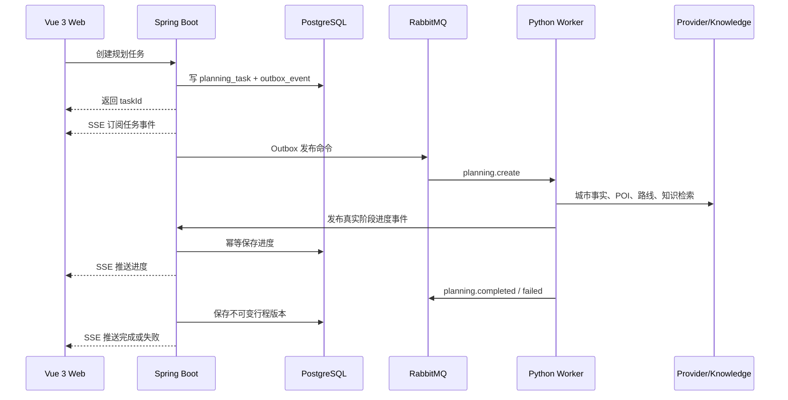

# 系统架构

- 文档状态：生效中
- 负责模块：全部
- 最后更新：2026-08-08
- 当前事实来源：是
- 替代文档：本文档替代 `docs/architecture.md`（已归档）
- 相关决策记录：
  - ADR-001 至 ADR-013（见 [ADR 索引](../adr/README.md)）
  - [Provider 模式与降级策略 ADR](../adr/Provider模式失败与降级策略.md)
  - [PlanEvaluation 策略 ADR](../adr/方案评估与解释策略.md)
- 相关领域文档：
  - [行程真实性与旅行骨架](行程真实性与旅行骨架.md)
  - [规划工作流](规划工作流.md)

## 概述

TripPilot 是三服务 Monorepo：Vue Web、Spring Boot 业务后端和 Python Agent Service。系统保持模块化单体的事务边界，同时把规划、Provider 调用和文本处理放到 Python 侧。

## 服务职责

| 服务 | 目录 | 职责 |
| --- | --- | --- |
| Web | `apps/web` | 登录、旅行工作台、规划进度、质量评估、地图概览、版本、分享和导出 |
| Java 服务端 | `apps/travel-server` | 身份、旅行、约束、规划任务、质量元数据持久化、安全、Outbox、SSE、诊断和导出 |
| Python Agent | `apps/agent-service` | 攻略抽取、城市知识处理、POI/路线 Provider、候选排序、约束求解、确定性质量评估和消息消费 |
| 消息契约 | `contracts` | Java、Python 和 TypeScript 共享的版本化消息契约 |
| 城市知识 | `knowledge` | 城市知识 Markdown、来源注册和固定评测语料 |
| 基础设施 | `infra` | 数据库扩展、Prometheus 配置和运行基础设施 |

## 运行链路



## 领域边界

- **Identity**：用户、JWT Access Token、HttpOnly Refresh Cookie 和会话轮换。
- **Trip**：旅行基础信息、结构化约束、归档状态和用户所有权。
- **Planning**：任务状态、幂等键、取消、进度事件和失败诊断。
- **Itinerary**：不可变版本、天、活动、交通段、编辑、差异和回滚。
- **Knowledge**：城市知识文档、片段、嵌入和检索结果。
- **City Intelligence**：来源注册、事实抽取、审核、合并、新鲜度和规划快照。
- **Share/Export**：固定版本的匿名只读分享、PDF 和 ICS。

Java 拥有用户可见业务事实和事务一致性；Python 只消费冻结输入、产出规划事件和候选结果。Worker 不直接修改用户业务表。

### 规划领域内部依赖

规划领域（Python 侧）内部按单向依赖组织，边界见[行程真实性与旅行骨架](行程真实性与旅行骨架.md)：

```text
Frozen Structured Constraints (Java 冻结)
  -> Trip Skeleton（全旅程聚合）
  -> Day Skeleton（锚点 / 固定安排 / 餐饮窗口 / 弹性槽位）
  -> Activity Placement + Transit
  -> Hard Validation -> Feasibility Report
  -> Experience Evaluation（仅对已验证行程）
  -> Immutable Itinerary Version（Java 持久化）
```

- **Skeleton / Feasibility / Evaluation 属于 Python 规划内部**，不直接暴露为 Java 业务表；Java 只持久化冻结快照、完成事件与不可变版本。
- **外部任务状态机**保持 `QUEUED/RUNNING/SUCCEEDED/FAILED/CANCELLED` 稳定不变。
- `Generated / Validating / Needs Repair / Repairing / Valid / Evaluating` 先作为 Python 内部阶段和诊断语义，不立即扩张稳定的持久化状态机。
- 只有验证、评估和 Java 持久化都成功后才对用户呈现 Completed。

## 数据所有权

| 存储 | Schema / 范围 | 所有者 | 内容 |
| --- | --- | --- | --- |
| PostgreSQL `business` | Java | Java | 用户、旅行、约束、任务、事件、行程版本、分享、诊断和审计 |
| PostgreSQL `agent` | Python | Python | 知识文档、嵌入、Agent 运行记录和评测数据 |
| Redis | — | Java/Python | Provider 缓存、短期协调和运行时缓存 |
| RabbitMQ | — | Java/Python | 规划命令、取消、进度、完成、失败和死信消息 |

稳定、需要查询或需要约束的数据关系化；结构会演进且仅在单次流程内消费的数据使用 JSONB。行程版本、规划快照和分享目标都不可变。

## 可靠性模型

### Transactional Outbox

数据库写入和消息发布通过 Outbox 保持最终一致。业务写入和对应的 Outbox 事件在同一数据库事务中完成，确保不会出现"写入了数据但消息丢失"或"消息已发但数据未写入"的情况。

### 消息投递

RabbitMQ 使用 at-least-once 投递语义。消费者用任务 ID、消息 ID 和序列号做幂等处理，确保重复投递不会产生重复副作用。

### 规划任务状态机

任务状态只允许以下转换：

```text
QUEUED -> RUNNING -> SUCCEEDED / FAILED / CANCELLED
```

同一旅行只允许一个修改行程的活动任务，避免并发覆盖当前版本。

### SSE 事件可靠性

SSE 事件持久化到数据库，浏览器断线后通过 `Last-Event-ID` 补发遗漏事件。每个进度事件至少包含 `stage`、`sequence`、`progress`、`message`、`occurredAt` 和 `taskId`。

### Provider 执行链

```text
WorkerSettings
  -> build_planning_provider
  -> DemoPlanningProvider | AmapPlanningProvider
  -> RetryingMapProvider / RetryingRouteProvider
  -> ProviderFallbackPolicy（仅显式 fallback 模式）
  -> PlannerPipeline
  -> Worker completion v8 | failure v2
  -> Java parser/consumer -> task event -> SSE/API
```

- `DEMO_ONLY` 完全不创建 AMap；`REAL_ONLY` 完全不创建 Demo/fallback。
- `REAL_WITH_EXPLICIT_FALLBACK` 才创建两者，并由集中白名单按 category、operation 与 retry exhaustion 判定。
- `RATE_LIMITED`、`TIMEOUT`、`NETWORK_ERROR`、`PROVIDER_UNAVAILABLE` 和部分 `MALFORMED_RESPONSE` 在单一执行层有限重试。
- 配置、鉴权、权限、配额、无效请求、Adapter 与内部错误默认不重试。

### 行程回滚

回滚不修改历史版本，而是复制目标版本并创建新的 `ROLLBACK` 版本。版本号单调前进，回滚本身可审计。

### PlanEvaluation

当前实现中，`PlanEvaluator` 在成功消息发布前以纯规则读取冻结 command 与 `PlanningResult`，生成五维评分、warning 和 evidence-backed decision，并对预算、日期范围和固定安排执行有限的硬规则守门。目标模型将完整可行性判断移入独立 Hard Validation；只有其通过后才进入 Experience Evaluation。两者的详细边界见[行程真实性与旅行骨架](行程真实性与旅行骨架.md)。

## 安全与合规

- Refresh Token 只通过 HttpOnly Cookie 传输，不进入 JavaScript。
- 所有用户数据按所有权校验隔离。
- 攻略 URL 经过公开 HTTPS、DNS 公网地址、同域重定向和响应大小限制检查。
- 系统不会登录站点、绕过验证码或批量爬取账号内容。
- 真实 Token、Cookie、Provider Key、模型 Key 和完整攻略正文不得进入日志。
- 内部诊断入口必须使用强随机令牌保护，且只暴露脱敏上下文。

## 可观测性

Prometheus 覆盖规划成功/失败/取消、阶段耗时、Provider 结果、RabbitMQ 积压和任务结果。关键日志携带 `traceId`、`tripId`、`taskId`、`messageId` 和 `provider` 等非敏感标识。Provider 回退使用稳定标记 `planning_provider_fallback`。

## 历史详稿

原始长文档已归档：

- [原系统架构详稿](../archive/architecture.md)
- [领域模型详稿](../archive/domain.md)
- [数据库设计详稿](../archive/database.md)
- [规划算法详稿](../archive/planning.md)
- [架构重构记录](../archive/architecture-refactoring-plan.md)
