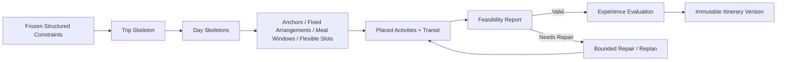

# 行程真实性与旅行骨架

- 文档状态：生效中
- 负责模块：agent-service、travel-server、web
- 最后更新：2026-08-08
- 当前事实来源：是
- 相关文档：
  - [产品概述](../product/产品概述.md)
  - [规划工作流](规划工作流.md)
  - [系统架构](系统架构.md)
  - [方案评估与解释策略 ADR](../adr/方案评估与解释策略.md)
- 相关代码：
  - `apps/agent-service/src/trip_agent/planning/daily_schedule.py`
  - `apps/agent-service/src/trip_agent/infrastructure/amap/planning_provider.py`
  - `apps/agent-service/src/trip_agent/evaluation/rules.py`

## 概述

本文档定义 TripPilot 的目标领域模型：一份"完整、真实、可执行"的旅行计划由什么构成，各概念之间的职责边界，以及硬校验与体验评估的分工。它是规划领域的**权威口径**——当其他文档（含历史归档）与本文冲突时，以本文为准。

文档同时标注**当前状态**与**目标模型**，避免把目标误当作现状。

## 当前状态与目标差异

| 维度 | 当前状态 | 目标模型 |
| --- | --- | --- |
| 骨架 | 已有逐日 `DayPlan`（日类型、锚点、固定安排、餐饮预留、弹性时段） | 增加跨全旅程的 `Trip Skeleton` 聚合，连接每日骨架与住宿状态 |
| 跨日去重 | 单次规划任务维护剩余候选集合，普通景点不再跨天重复；允许重复类型尚未细分 | 全旅程候选使用集合，按允许重复规则（景点不重复，酒店/枢纽/餐厅可重复）去重 |
| 住宿 | 已选酒店使用真实住宿锚点；未选酒店在过夜边界生成 Unresolved 语义节点，不伪造 POI/坐标；Area Estimated 尚未实现 | 完整 `Accommodation State`：Confirmed / Area Estimated / Unresolved，并纳入跨日连续性验证 |
| 游玩时长 | 固定量级默认值 LIGHT 90 / NORMAL 150 / HALF_DAY 240 / FULL_DAY 480 分钟 | 版本化 `Visit Duration Profile`：minimum / recommended / maximum + provenance + confidence |
| 餐饮 | 已建模为预留时间的 `MealDemand`，但最终落入 Activity 形态 | `Meal Window` 作为独立语义节点，餐厅是后续绑定，明确"时间已保留、地点待定" |
| 校验 | 已强制预算、日期范围、固定安排覆盖、重复 POI 和活动重叠；其余规则仍混在现有流程或缺失 | 独立 `Hard Validation` 层，覆盖重复 POI、跨日住宿、端点、重叠、开放时间、时长、餐饮 |
| 评分 | evaluation v2 已将无预算/无兴趣表达为 N/A 并归一化权重；可行性守门仍混在 evaluator 内部 | 硬校验通过后才进入独立体验评估 |

## 目标领域模型

### 核心概念

| 概念 | 定义 |
| --- | --- |
| **Planning Snapshot** | Java 冻结的规划输入和证据，规划过程中不变。是 Worker 消费的只读基线。 |
| **Trip Skeleton** | 跨越整个旅行的临时领域聚合，不等于最终行程版本。承载每日骨架、住宿语义和跨日连续性。 |
| **Day Skeleton** | 单日结构：日类型、可用边界、固定节点、餐饮窗口和弹性活动槽位。 |
| **Anchor** | 结构固定节点：Arrival、Departure、Accommodation、Fixed Arrangement。 |
| **Accommodation State** | 住宿语义三态：Confirmed（已选酒店）、Area Estimated（仅知道区域）、Unresolved（完全未解析）。不在本文档锁定具体代码枚举。 |
| **Meal Window** | 占用容量的特殊节点；具体餐厅是后续绑定，不等同于普通景点。 |
| **Flexible Activity Slot** | 可由 optimizer 填充的时间区间，受锚点和固定安排约束。 |
| **Visit Duration Profile** | 一个地点/类别的游玩时长画像：minimum、recommended、maximum、complexity、provenance、confidence。 |
| **Activity** | 被放入槽位后的候选 POI。 |
| **Transit** | 连接两个可执行节点；端点必须与相邻节点一致，不能出现"断头"路线。 |
| **Feasibility Report** | 硬规则验证结果和修复原因，是"可执行"结论的唯一来源。 |
| **Experience Evaluation** | 只评价已经有效的行程；不负责把不可行结果包装成成功。 |

## 骨架场景规则

| 场景 | 规则 |
| --- | --- |
| 单日游 | Arrival → 活动/餐饮/交通 → Departure；没有过夜就不强制住宿。 |
| 多日游 | 首日到达住宿，普通日从住宿出发并返回，末日从住宿出发后前往 Departure。 |
| 第一天晚到 | 收缩首日窗口；容量不足时允许只有到达、餐饮和住宿，不强塞景点。 |
| 最后一天早离开 | 收缩末日窗口；Departure 和必要换乘优先于活动数量。 |
| 已选酒店 | 使用确认 POI 作为跨日统一住宿锚点。 |
| 未选酒店 | 仍创建住宿语义节点，不得等价为"没有住宿"。 |
| 仅知道区域 | 使用区域估算锚点，清楚标记估算性质，不伪造酒店 POI。 |
| 完全未解析 | 保留 Unresolved 状态并进入修复或用户补充流程。 |
| 固定预约 | 先进入骨架并占用准确窗口，再计算弹性容量。 |
| 跨日连续性 | DAY N 的最后可执行节点必须能到达过夜锚点；DAY N+1 从同一住宿语义状态开始。 |

## 住宿状态（Accommodation State）

- **Confirmed**：用户选择了具体酒店，它成为跨日统一住宿锚点，首日与末日节点与其一致。
- **Area Estimated**：仅知道住宿区域时，使用区域估算锚点；必须标记估算性质，不伪造酒店 POI。
- **Unresolved**：完全未解析时保留 Unresolved 状态并进入修复或用户补充流程。**开放问题**：Unresolved 是否允许生成"草案"，还是必须阻止可执行完成，见"未决问题"一节。

## 餐饮窗口（Meal Window）

- 系统默认餐饮要求至少保留用餐时间；具体餐厅未解析可作为明确警告。
- 用户显式指定的餐饮窗口是**硬约束**。
- `Meal Window` 是占用容量的特殊节点，与普通景点不同——它不参与"景点堆叠"的体验奖励，餐厅解析是后续绑定。

## Candidate Quality（候选质量）

- Provider 原始 POI 在进入候选排序前先经过 **Candidate Quality Filter**（`planning/poi_quality.py`）。
- 过滤基于 **Provider type / category**（AMap `type_code` 大类）为主规则，名称兜底仅覆盖缺失/歧义编码的少量设施：
  - **FILTER**：公交站、地铁站、停车场、充电站、加油站、服务区、车站出入口等纯交通附属设施——不得作为普通 Activity。
  - **ANCHOR_ONLY**：火车站、机场、客运站、长途汽车站——**保留**用于 ARRIVAL / DEPARTURE 锚点，但不作为普通 Activity。
  - **KEEP**：风景名胜、游乐场等正常旅行候选。
- 必须区分"不能作为普通 Activity"与"系统永远不能使用这个 POI"——交通枢纽永远保留。

## Visit Duration 规则

- Provider 有可靠游玩时间时作为**优先事实**，并记录来源与新鲜度。
- Provider 缺失时按 POI 类别、规模和场景使用**版本化默认区间**，由 `poi_quality.duration_profile_for` 产出带 `source` 的画像：
  - LIGHT（小型寺庙/纪念馆/故居等）：45–120 分钟，recommended 90。
  - NORMAL（普通景点）：90–180 分钟，recommended 150。
  - HALF_DAY（风景区/大型博物馆等）：180–300 分钟，recommended 240。
  - FULL_DAY（主题公园/长隆/山岳等）：360–540 分钟，recommended 480。
- LIGHT 标记刻意排除歧义地标词（"塔"、"楼"），避免把广州塔这类地标当小景点。
- Agent/LLM 只能给出**带来源和置信度的建议**，不能覆盖可靠硬事实。
- Optimizer 只能在 minimum–maximum 内调整，以 recommended 为软目标。
- FULL_DAY 活动先占据当天主要骨架，不用"剩余时间"拉长普通 POI。

## 跨日连续性

跨日连续性是硬规则：

1. DAY N 的最后可执行节点（活动或交通段）必须能到达过夜锚点。
2. DAY N+1 从同一住宿语义状态开始。
3. 任一日期被局部编辑破坏连续性时，影响范围必须重新验证（见[行程版本与编辑模型](行程版本与编辑模型.md)）。

## 硬校验 vs 体验评估

| Hard Validation | Experience Evaluation |
| --- | --- |
| 决定能否完成并持久化为"可执行计划" | 决定有效计划的体验质量 |
| 失败进入修复、需要输入或失败终态 | 不改变可行性 |
| 非允许类型的重复 POI | 软约束满足程度 |
| Arrival、Departure、住宿和跨日连续性 | 时间舒适度与节奏 |
| Transit 端点及不可能路线 | 路线平滑度和绕行程度 |
| 活动重叠、固定预约、必去地点 | 预算贴合度 |
| 已确认开放时间冲突 | 兴趣匹配度 |
| 时长超出合理上下界 | 内容丰富度（不鼓励堆叠 POI） |
| 明确餐饮窗口和必要用餐时间缺失 | 时长接近推荐值的程度 |
| 安全换乘时间不足 | 非硬性的体验余量 |

### 推荐评分原则

- 无兴趣偏好时 `interestMatch=N/A`，无预算时 `budgetFit=N/A`；总分只在适用维度上重新归一化权重。
- Continuity 以硬门禁为主，不重复奖励"本来就必须正确"的结构。
- Duration 的上下界属于硬规则；接近 recommended 属于体验评价。
- UI 分开显示"行程可执行：已验证/待修复"和"体验评分"。
- 硬校验失败时不生成 98/100，也不产生成功版 PlanEvaluation。

## 数据/推导/建议/优化器权限边界

| 角色 | 目标职责 |
| --- | --- |
| Java application/domain | 校验并冻结输入；拥有任务生命周期、幂等、不可变版本持久化及完成事务。 |
| Python planning pipeline | 构建骨架、组织候选、时长、活动、餐饮、交通、验证和有界修复。 |
| Optimizer / OR-Tools | 在已知窗口、锚点和时长范围内做组合选择与放置；不得创造事实或改变业务语义。 |
| Evaluator | 在 Hard Validation 通过后计算体验质量，不负责把不可行结果包装成成功。 |
| Provider | 提供 POI、路线、开放时间和可能的时长证据；不决定领域策略。 |
| Frontend | 收集一致约束、展示执行状态和行程，不伪造进度或可行性。 |

## 现有代码对应

| 目标概念 | 现有实现 |
| --- | --- |
| Day Skeleton / 锚点 | `daily_schedule.py`：`TravelAnchor`、`FixedSchedule`、`VirtualDayOrigin`、`DayPlan` |
| 日类型 | `classify_day_type()`：ARRIVAL_DAY / FULL_DAY / DEPARTURE_DAY / SPECIAL_ACTIVITY_DAY |
| 餐饮预留 | `MealDemand`（注释即"reserved meal time slot that still needs a real restaurant POI"） |
| 弹性时段填充 | `compute_free_windows()` + `_fill_slots()` |
| 游玩时长默认值 | `poi_quality.py` 按类别产出带 `source` 的画像；`daily_schedule.py` 用 magnitude 映射（LIGHT 90 / NORMAL 150 / HALF_DAY 240 / FULL_DAY 480） |
| 候选质量过滤 | `poi_quality.py` 按 Provider type 过滤公交站/停车场等，保留火车站/机场作锚点 |
| 逐日编排 | `planning_provider.py` 逐日循环调用 `plan_day`，并在任务范围消费候选以避免普通景点跨日重复 |
| 未解析住宿 | `planning_provider.py` 在过夜边界生成无 POI、无坐标的 Unresolved 住宿语义节点 |
| 硬规则 | `evaluation/rules.py` 拒绝重复 POI 与活动时间重叠，并保留预算/日期/固定安排校验 |
| 评分规则 | `evaluation/scoring.py` 与 evaluator v2：适用维度归一化，预算/兴趣缺失为 N/A |

## 未决问题

- Unresolved 住宿是否允许生成"草案"，还是必须阻止可执行完成。
- 区域估算住宿锚点由用户、Provider 还是城市中心策略确定。
- 允许重复的地点集合：酒店、交通枢纽和餐厅需要不同于景点的规则。
- 默认餐饮与用户显式餐饮窗口的硬约束边界。
- Provider 无开放时间时，计划能否标记"已验证"，还是只能"需出发前确认"。
- Visit Duration 类别默认值的版本治理和 Agent 建议可信度。
- N/A 权重归一化后，历史评分如何展示和比较。
- Meal、Anchor 是否继续兼容为 Activity，还是未来形成独立持久化节点。
- 局部编辑破坏跨日连续性时，是拒绝保存、标警告还是强制局部重规划。

## 历史文档

- [原领域模型详稿](../archive/domain.md)
- [原规划算法详稿](../archive/planning.md)
