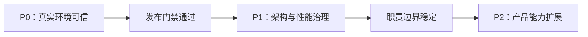

# V2.5 之后的 P0–P2 执行规划

状态：待确认实施  
基线：`main` / `2cbd766`（2026-07-30）  
前置证据：[V2.5 验收记录](v2.5-release-evidence.md)

## 目标与边界

本规划将下一轮工作分为三个不重叠的优先级：

- **P0：生产可信度。** 让已完成的 V2.5 能够在受控真实环境中安全部署、观测、恢复和验收。
- **P1：架构可维护性。** 在不改变用户功能和 API 语义的前提下，拆分高耦合模块并增强契约与性能保护。
- **P2：产品扩展。** 在稳定架构上扩展多城市、协作和出发前服务等能力。

本规划不包含机票、火车票、酒店库存、支付或绕过第三方反自动化限制。它们只有在独立商业与合规决策后才能进入范围。

## 总体执行规则

1. 每个工作包先补充验收测试或可复现演练，再实施变更。
2. 所有数据库改变使用向前 Flyway migration；不重写已发布 migration。
3. Java、Python、Web 和 MQ/SSE 契约的变更必须同步更新 `contracts/`、接口文档和消费者测试。
4. P0 完成前，不把本地 Demo 或模拟 Provider 的结果表述为真实生产 Provider 验收。
5. 每个阶段结束都执行全量质量门禁、部署健康检查、回滚演练，并记录证据。

## 阶段 0：实施准备

| 工作项 | 产物 | 验收标准 |
| --- | --- | --- |
| 冻结基线 | 当前提交 SHA、环境清单、依赖版本 | 干净工作区；可从 SHA 重建镜像 |
| 责任划分 | 每个工作包的负责人、审批人、回滚负责人 | 无“无人负责”的密钥、迁移和告警项 |
| 环境隔离 | 本地、预生产、生产的独立数据库、Redis、RabbitMQ 与密钥 | 三个环境互不共用数据或 Token |
| 发布证据模板 | 版本、镜像 SHA、测试输出、变更记录、回滚结果 | 模板不包含 Key、Cookie、完整敏感 URL 或 Token |

阶段 0 的完成条件：预生产域名、HTTPS 终止位置、密钥存储方式和部署责任人均已明确。

---

## P0：生产可信度与发布闭环

### P0.1 配置、密钥与网络边界

**目标：** 消除“本地可运行、线上配置不确定”的风险。

| 任务 | 实施内容 | 验收标准 |
| --- | --- | --- |
| 配置分层 | 将环境变量分为公开构建变量、运行时业务配置和机密；为每项记录来源与轮换责任 | `.env.example` 不含真实凭据；生产密钥不进入镜像、Git 或浏览器日志 |
| HTTPS 与 Cookie | 配置反向代理、可信代理网段、HTTPS、HSTS 与 `REFRESH_COOKIE_SECURE=true` | 登录、刷新、退出和跨站请求在真实域名上通过；Cookie 不在 HTTP 上传输 |
| 最小网络权限 | 限制数据库、Redis、RabbitMQ、Prometheus 和诊断入口的暴露范围 | 公网仅暴露必要 Web/HTTPS 入口；内部服务不能被匿名访问 |
| 密钥轮换演练 | 为 JWT、内部 Agent Token、诊断 Token 与 AMap Key 制定轮换步骤 | 轮换后新请求成功、旧凭据失效、服务无持久中断 |

### P0.2 真实高德 Provider 验收

**目标：** 将 AMap 从“已接入代码”升级为“已在目标域名验证”。

| 场景 | 需要验证的结果 |
| --- | --- |
| Web JS 地图 | 在最终 HTTPS 域名加载底图、标记和路线；地图实例创建后不会因 `complete` 事件缺失被隐藏 |
| POI 与路线 | 新建旅行可获得标记为 `AMAP` 的地点、路线与 Provider 元数据 |
| 交通建议 | 长步行生成可确认的公交/打车建议；确认后写入一个新的不可变版本 |
| 短暂失败 | 超时、5xx、限流时明确标记降级/过期结果，并记录可观测事件 |
| 永久失败 | 鉴权、Key、域名白名单或配额不可用时任务进入明确失败终态，不伪装为成功 |

实施要求：使用专门的预生产 Key、受控测试账户和隔离数据；截图、任务 ID、trace ID、错误码及时间戳进入脱敏验收记录。

### P0.3 可观测性、告警与恢复

**目标：** 出现问题时可发现、可定位、可恢复。

| 任务 | 实施内容 | 验收标准 |
| --- | --- | --- |
| 指标与仪表盘 | 规划成功率、耗时、Provider 失败率、队列积压、SSE 重连、版本提交失败率 | 每项有阈值、看板和负责人 |
| 告警演练 | 模拟数据库不可用、消息堆积、Provider 连续失败、Worker 异常退出 | 在约定时间内产生告警，并能定位到服务与任务 |
| 备份恢复 | PostgreSQL 备份、恢复、恢复点说明及定期演练 | 从备份恢复到隔离环境并完成登录、旅行读取和版本读取校验 |
| 回滚 | 镜像回滚、应用配置回滚与迁移兼容性说明 | 可回到上一镜像；新 migration 不破坏旧应用读取路径 |

### P0.4 部署后自动化验收

**目标：** 让发布门禁自动判断“可用”，而不是依赖人工浏览。

1. 在 CI 执行 Java、Python、Web 单元/集成测试、静态检查和构建。
2. 在预生产环境执行登录、创建旅行、规划、SSE、草稿确认、版本、分享和导出的冒烟测试。
3. 加入 Java ↔ Python 的 MQ 事件和 JSON Schema 契约测试；覆盖成功、可重试失败、永久失败和重复投递。
4. 发布后执行只读健康检查与关键指标检查；失败时自动停止推广并进入回滚流程。

**P0 完成门禁：**

- 真实 HTTPS 域名的 AMap、登录、刷新、规划和版本确认全部成功。
- 关键失败场景完成演练，降级或失败状态与日志/指标一致。
- 备份恢复和镜像回滚至少各成功一次。
- 发布证据、当前发布状态和部署文档已更新。

---

## P1：架构、性能与质量治理

P1 的原则是不扩展产品范围，优先降低变更成本。现状中 `TripDetail.vue` 和 `ItineraryService.java` 的职责过多，应作为第一批拆分对象。

### P1.1 前端行程工作台拆分

| 目标组件/层 | 从当前职责中移出 | 验收标准 |
| --- | --- | --- |
| `ItineraryTimeline` | 日程、活动排序、活动操作入口 | 只负责显示和发出意图，不直接请求 API |
| `TransitEditor` | 交通选项、长步行推荐、锁定和冲突提示 | 单独组件测试覆盖推荐、锁定、放弃和失败重试 |
| `ItineraryDraftStore` 或 composable | 草稿合并、放弃、提交、版本冲突处理 | 草稿状态不依赖单页组件生命周期；可测试地恢复/清除 |
| `ItineraryVersionWorkspace` | 版本列表、差异和回滚 | 版本查询、回滚和折叠逻辑与日程渲染分离 |

### P1.2 后端行程用例拆分

将 `ItineraryService` 拆为以用例命名的应用服务，并保持已有 REST API 与数据库语义兼容：

- `PreviewItineraryEditUseCase`
- `CommitItineraryDraftUseCase`
- `ItineraryVersionQueryService`
- `TransitLegEditService`
- `ItineraryEditEvaluator`
- `ItineraryVersionPersistenceGateway`

验收标准：Controller 仅进行认证、输入绑定和响应转换；领域评估不依赖 HTTP；批量草稿提交、幂等、冲突、回滚和导出均保有集成测试。

### P1.3 数据访问与性能治理

1. 对旅行列表、行程读取、版本差异和分享读取执行查询分析，消除 N+1 查询。
2. 对长行程、多个版本和大量分享读取定义分页、索引和响应大小上限。
3. 对规划任务、Provider 调用和导出设置超时、限流、重试边界和熔断策略。
4. 为关键接口建立基线性能测试，并在 CI 中保留回归阈值。

### P1.4 质量门禁收紧

- Web、Java、Python 的关键用户链路全部进入 CI；浏览器测试按稳定性分层运行。
- 所有新增 REST/MQ/SSE 字段均由生产者与消费者契约测试保护。
- 引入架构测试，禁止 Web 组件直接承担 API 编排，禁止应用层直接依赖外部 Provider 实现。
- 更新 `docs/release.md`，使其不再仅描述 V2.0，而是引用当前 V2.5 证据和后续门禁。

**P1 完成门禁：** 现有 API 无破坏性变化；全量测试通过；核心页面和服务不再承担多项不相干职责；性能基线可重复执行。

---

## P2：产品能力扩展

P2 仅在 P0、P1 门禁均通过后启动。每个产品包先完成用户价值验证和数据模型设计，再进入实现。

### P2.1 多城市与跨城行程

**范围：** 旅行区段、城市切换、跨城交通时间窗、酒店/住处作为约束锚点、多日路线重算。

**先决决策：** 交通数据来源、跨城费用模型、时区规则和多城市知识数据策略。

**验收：** 用户可创建至少两城市的旅行；跨城移动不可与活动冲突；版本差异清楚展示城市和区段变化。

### P2.2 协作与版本确认

**范围：** 邀请成员、角色（拥有者/编辑者/查看者）、评论、待确认变更、版本确认记录和通知。

**架构约束：** 以旅行成员关系和审计事件为领域模型；不得以共享 Token 替代授权；并发编辑采用明确冲突策略。

**验收：** 两位编辑者可查看冲突、保留各自草稿；拥有者可审阅并确认版本；匿名分享仍只读且版本固定。

### P2.3 出发前服务与个性化

**范围：** 天气/闭馆/预约提醒、收藏和模板、偏好学习、行程质量评分、出发前核验清单。

**验收：** 每条提醒有来源、更新时间和可解释影响；用户可关闭提醒；系统不把过期事实表现为实时结论。

### P2.4 商业闭环前的探索项

预订跳转、联盟链接、支付和供应商库存不属于默认实现范围。若进入立项，需要先完成法律合规、订单边界、资金安全、退款责任和客服流程设计。

**P2 完成门禁：** 新能力具有独立用户旅程、授权模型、数据迁移、监控指标、降级方案、端到端测试和更新后的产品/架构文档。

## 测试与验收矩阵

| 层级 | P0 | P1 | P2 |
| --- | --- | --- | --- |
| 单元测试 | 配置解析、失败分类、脱敏 | 用例、草稿状态、领域评估 | 新领域规则与权限 |
| 集成测试 | Provider、备份恢复、迁移、MQ | 版本、性能、查询与契约 | 协作冲突、跨城约束 |
| 浏览器测试 | 真实域名冒烟与核心闭环 | 重构不回归的关键链路 | 多城市、协作与提醒旅程 |
| 运维演练 | 告警、回滚、恢复、密钥轮换 | 容量与性能回归 | 新服务降级与数据保护 |

## 风险与决策点

| 风险 | 应对方式 | 需要的决策 |
| --- | --- | --- |
| AMap 配额、Key 或白名单导致不可用 | 预生产独立 Key、失败分类、降级与监控 | 预生产/生产域名及 Key 管理责任人 |
| P0 与新功能并行导致上线风险 | P0 期间冻结 P2 功能开发 | 是否允许并行试验分支 |
| 大文件重构造成行为回归 | 按用例拆分、保持 API、先补测试 | P1 是否允许短期内部接口兼容层 |
| 多人协作带来权限与冲突复杂度 | 先定义成员/审计模型，再做 UI | 协作角色与版本最终确认人 |
| 预订/支付扩大合规责任 | 独立立项与风险评估 | 是否将商业交易纳入产品战略 |

## 最终完成定义

本规划不是按日期完成，而是按门禁完成：

1. **P0 结束：** 系统可以在真实受控环境中安全发布、验证、告警、恢复和回滚。
2. **P1 结束：** 核心行程模块职责清晰、性能有基线、契约与回归门禁覆盖关键边界。
3. **P2 结束：** 新产品能力不破坏现有版本、权限、可靠性和可解释性模型。

任何阶段如果缺少外部域名、密钥权限、部署责任或产品决策，应记录为外部阻塞，不通过模拟结果宣布该阶段完成。
